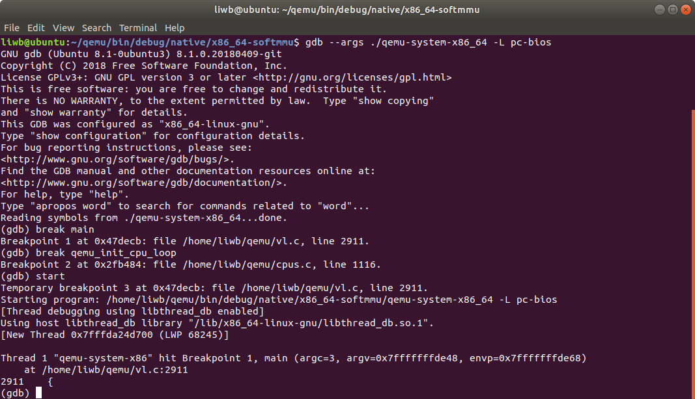
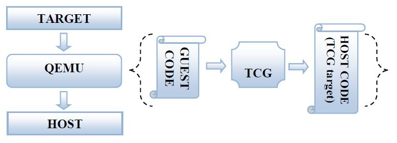
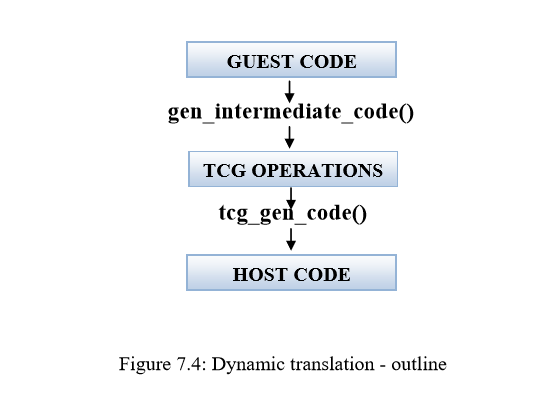
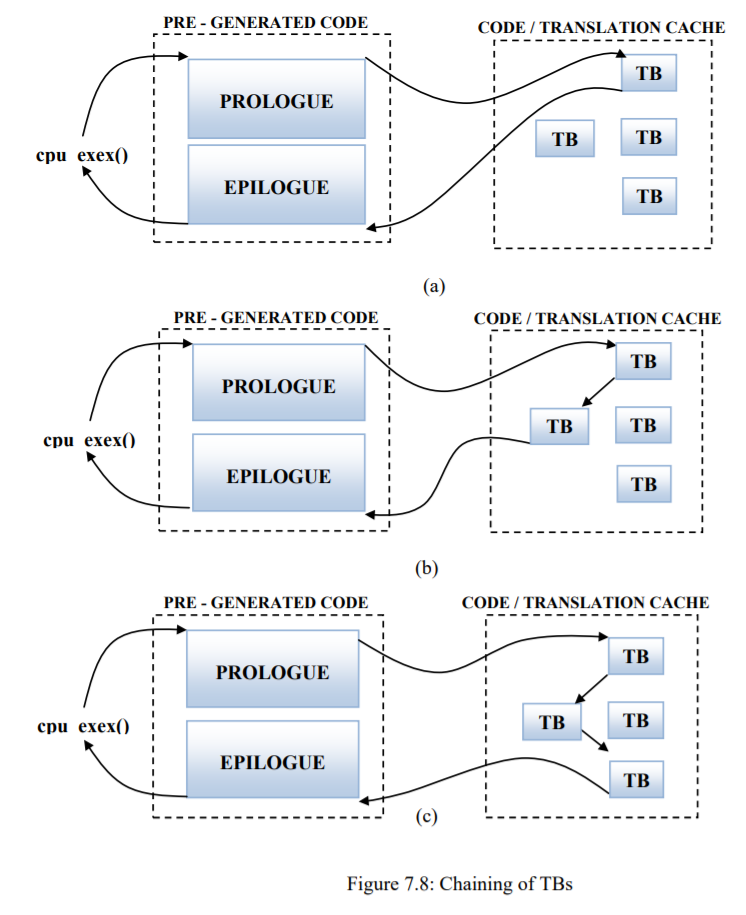
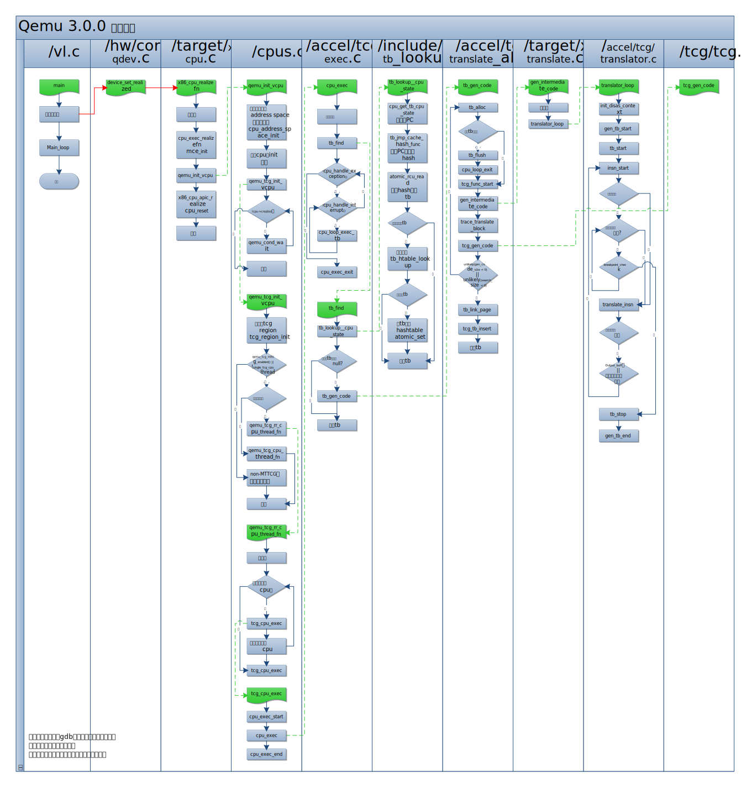

需要解决的问题：
1. 如何使用qemu模拟执行guest代码 ✔
1. 如何在已有target构架基础上，修改出自己需要的新构架
    - 如何在qemu中添加一个新的target构架：在/target/下新建转换为tcg的代码
        - 如何让qemu加载添加的新构架
        - 如何配置configure，可以正确的编译新增代码

下步工作：
1. gen_intermediate_code函数分析
1. 重新调整文档格式
        
# 编译安装
linux安装指导：https://wiki.qemu.org/Hosts/Linux
## 代码下载
下载页面：https://www.qemu.org/download/

git地址：https://git.qemu.org/?p=qemu.git， 或者：https://github.com/qemu/qemu

直接下载源码包编译会提示/tests等目录无法找到，需要从git clone

```shell
git clone git://git.qemu-project.org/qemu.git
```

还需要执行`git submodule update`下载所有的git子模块

## 安装依赖包
代码下好后安装依赖包（ubuntu环境）
```shell
sudo apt-get install git libglib2.0-dev libfdt-dev libpixman-1-dev zlib1g-dev

sudo apt-get install libnfs-dev libiscsi-dev

sudo apt-get install git-email
sudo apt-get install libaio-dev libbluetooth-dev libbrlapi-dev libbz2-dev
sudo apt-get install libcap-dev libcap-ng-dev libcurl4-gnutls-dev libgtk-3-dev
sudo apt-get install libibverbs-dev libjpeg8-dev libncurses5-dev libnuma-dev
sudo apt-get install librbd-dev librdmacm-dev
sudo apt-get install libsasl2-dev libsdl1.2-dev libseccomp-dev libsnappy-dev libssh2-1-dev
sudo apt-get install libvde-dev libvdeplug-dev libvte-2.90-dev libxen-dev liblzo2-dev
sudo apt-get install valgrind xfslibs-dev 

```

## 代码编译

```shell
cd qemu
mkdir -p build
cd build
../configure --target-list=x86_64-softmmu,arm-softmmu --enable-debug --enable-debug-info # 只编译x86，arm版本
make
```
编译完成后运行
```
./build/x86_64-softmmu/qemu-system-x86_64 -L pc-bios
```
如果依赖包安装没有装完全，编译时会没有gtk支持，运行时console显示`VNC server running on 127.0.0.1:5900`，在浏览器中打开，可以看见运行结果（一行文本）。可以运行`./build/x86_64-softmmu/qemu-system-x86_64 -L pc-bios -nographic`来在console中显示。
如果运行正常，会弹出一个虚拟机界面显示运行情况。

如果编译时指定了多个target，那么编译完成后，在build目录下会有以每个target-name命名的文件夹，这个文件夹中有一个qemu-system-{target-name}的文件，就是qemu针对不同target的执行程序。
在build目录下还会有几个qemu的通用工具：
* qemu-img：创建磁盘镜像，创建出的镜像格式有[qcow](https://people.gnome.org/~markmc/qcow-image-format.html)、raw等等
* qemu-ga：这是一个不利用网络实现 guest 和 host 之间交互的应用程序（使用 virtio-serial），运行在 guest 中。
* qemu-io：这是一个执行 Qemu I/O 操作的命令行工具。
* qemu-nbd：磁盘挂载工具。

# 使用GDB调试
运行`gdb --args ./qemu-system-x86_64 -L pc-bios`（--args后面时qemu的运行命令，可以运行其他镜像）。然后可以使用gdb命令进行设置断电例如`break main`，在main函数设置断点。

GDB调试QEMU时经常遇到SIGUSR1与SIGUSR2后停下来，解决办法是执行命令：（网上说的，没遇到过）
```
(gdb) handle SIGUSR1 SIGUSR2 noprint nostop
```

## gdb命令
break 设断点，`break function_name`可以在对应函数设置断点
c 继续运行
bt 查看调用堆栈
layout src 看源码
info threads 查看线程

## 参考
https://www.cnblogs.com/woshiweige/p/4518431.html
https://www.cnblogs.com/shaohef/p/4532437.html

# 代码构架
主要翻译自qemu detailed study，只有第7章，其他章节没找到。这篇文章应该是基于v0.13.x版本写的，和现有的构架有很多不同，所以有些部分做了修改。

其他资料：
[各种姿势折腾 QEMU](https://blog.csdn.net/kids412kelly/article/details/52509670)

[qemu源码架构](https://blog.csdn.net/dj0379/article/details/54926443)

[QEMU开发新的架构一](https://blog.csdn.net/ivanx_cc/article/details/46122783)

[QEMU代码分析（1）－module_init()构造函数](https://blog.csdn.net/miaohongyu1/article/details/25954005)

[关于qemu的二三事（5）————qemu源码分析之参数解析](https://blog.csdn.net/Benjamin_Xu/article/details/72824904)

## 基本概念
QEMU模拟的架构叫`target`，运行QEMU的系统架构叫`host`。虚拟机(target)代码的动态生成通过一个角TCG(Tiny Code Generator)的模块完成。TCG生成被虚拟机执行的代码，因此被TCG生成的代码叫做TCG的target（这里的target和前面qemu的target不一样）。



运行在虚拟处理器上的代码（操作系统+用户工具）叫做guest code。qemu解析guest code并将其转换为host specific code（这里保留host，guest的叫法，翻译成中文了容易混淆）。整个转换的任务包含两部分：
* 首先是将一段target代码（就是guest code），也叫Translation Block(TB)，转换为TCG操作，一种与体系结构无关的中间代码。
* 然后这个TB对应的TCG根据host构架被转换成对应的host code，过程中会执行一些优化策略。

## 代码构架

1. 程序入口。主要的文件包括/vl.c,/cpus.c, /execall.c, /exec.c, /cpu-exec.c。`main`函数在/vl.c中，这个文件中的其他函数设置了虚拟机的其他参数，例如ram大小，cpu数量等。在虚拟机设置完成后，`main`函数会调用其他文件中的函数例如/cpus.c, /exec-all.c, /exec.c, /cpu-exec.c（execution branches out through files such as /cpus.c, /exec-all.c, /exec.c, /cpu-exec.c.） （main函数在2910行）
 
1. 硬件模拟。所有模拟虚拟硬件的代码都放在/hw/中。
 
1. Guest (Target) Specific: 现在QEMU中已经模拟的处理器结构包括Alpha, ARM, Cris, i386, M68K, PPC, Sparc, Mips, MicroBlaze, S390X and SH4。将这些结构的TB转换为TCG操作的代码实现在/target/arch/中（添加新的结构应该就在这里），例如i386构架的代码在/target/i386/。这部分代码叫TCG前端（frontend of TCG）.。
 
1. Host (TCG) Specific: 从TCG操作中生成主机代码的代码在/tcg/host_arch/中，例如i386构架的代码在/tcg/i386/。这部分代码叫做TCG后端（backend of TCG）。 

1. 总结。

    * /vl.c : 主模拟器循环，虚拟机设置和CPU执行（The main emulator loop, the virtual machine is  setup and CPUs are executed）。
    
    * /target/xyz/translate.c : 将客户端代码（客户端指令集）转换成与指令集构架无关的TCG操作。
    
    * /tcg/tcg.c : TCG的主循环.  
    
    * /tcg/*/tcg-target.c :  将TCG操作转换为本机ISA代码。 
    
    * /cpu-exec.c :  函数cpu-exec()寻找下一个TB，如果没有找打，则生成未找到TB的信号来产生一个新TB，最后执行生成的代码（应该是从TB->TCG，执行的是TCG？）。 cpu-exec() finds the next translation block (TB), if not found calls are made to generate the next TB  and finally to execute the generated code. 


## TCG-动态翻译
QEMU v0.9.1版本之前动态翻译都是由DynGen完成的。TB被DynGen转换为C代码，再由GCC将C代码转换为主机代码(host specific code)。为了解除与GCC的紧密联系，产生了一种新机制:TCG。

动态翻译使得代码再需要时才被转换。这个思想的主要目的是用最多的时间去执行生成后的代码而不是去生成代码(The idea was to spend the maximum time executing the generated code that executing the code generation)。每当从TB转换为代码（应该指的是TCG）后，这些代码会再执行前先被存储起来。多数时候相同的TB会被多次调用，这样通过本地引用（Locality Reference）可以重复使用之前转换好的代码。当指令缓存(code cache)填满时，整个缓存会被清空而不是使用LRU算法（least recently used，缓存淘汰算法）。


> 下面这一段说的是一般的编译过程，为了和tcg做对比

在执行前编译器从源代码(source code)中生成结果代码(object code)。为了生成一个函数调用的结果代码，编译器（例如GCC）会在函数调用之前和之后插入一些特殊的汇编码（assembly code），这些汇编码称作Function Prologue and Epilogue。

如果体系结构（应该指的是target的结构）有一个基指针和一个栈指针，则Function Prologue通常执行以下操作：
 
1. 将当前基指针压入栈中，以便后续恢复。
1. 将旧的基指针替换为当前栈指针，这样新栈会在旧栈的顶端产生。（应该是将基指针指向栈顶） Replaces the old base pointer with the current stack pointer such that the a new stack will be created on top of the old stack. 
1. 将栈指针向当前栈顶移动，给函数中的局部变量在栈中腾出存储空间。Moves the stack pointer further along the stack to make room in the current stack frame for the function's local variables. 

Function Epilogue恢复 function prologue执行的操作，并将控制权交会调用它的函数（ and returns control to the calling function，应该是只qemu的CPU调用循环）。它通常执行以下操作: 

1. 将栈指针替换为当前基指针，这样栈指针就恢复成prologue之前的值。
1. 将之前的基指针出栈，这样基指针就恢复成prologue之前的值。
1. 弹出之前的程序指针并跳转，回到之前调用的函数。（Returns to the calling function, by popping the previous frame's program counter off the stack and jumping to it）

TCG可以被看作一个生成object code的编译器。通过TCG生成的代码存储在缓存(code buffer)中，通过TCG的 Prologue和Epilogue功能来执行code buffer中的代码或者从中跳出（The execution control is passed to and from the code cache through TCG’s very on Prologue and Epilogue）。执行的流程见下图


下面4幅图介绍了TCG是如何工作的：




## TB链（Chaining of TBs）
从code cache返回到静态代码（QEMU程序），或者跳转到code cache通常都十分缓慢。为了解决这一问题，QEMU将每一个TB都链接到下一个TB。这样在执行完一个TB后会直接执行下一个TB而不是返回静态代码（QEMU程序）。当不存在链接(no chaining)的TB1执行完返回静态代码后，紧接着发现、转换、执行了TB2，那么当TB2返回时就会被自动的链接到TB1上。这样下次TB1执行完成后就会直接执行TB2，而不返回静态代码。如下图所示。



## 执行过程
qemu基本的执行流程可以参加下图，图中最上部分表格表示所对应的文件位置，绿色方框代表函数，浅蓝色方框代表执行流程，红色连接线代表尚未完全清楚的调用关系，蓝色连接线代表程序执行流程，绿色虚线代表将函数执行的过程展开描述。


### main(..){/vl.c}
main函数解析命令行输入参数，本根据参数设置虚拟机(VM)，例如ram，磁盘大小，启动盘等。当VM设置完成后，main()调用main_loop()。
qemu_init_cpu_list();
qemu_init_cpu_loop();

main函数和主要的执行过程cpu_exec之间的调用关系并没有完全明确，通过gdb调试，可以得到如下的调用堆栈：
```shell
#0  0x0000555555850801 in qemu_tcg_init_vcpu (cpu=0x555556b54fc0) at /home/liwb/qemu/cpus.c:1854
#1  0x0000555555850df7 in qemu_init_vcpu (cpu=0x555556b54fc0) at /home/liwb/qemu/cpus.c:2007
#2  0x000055555594ca35 in x86_cpu_realizefn (dev=0x555556b54fc0, errp=0x7fffffffd780) at /home/liwb/qemu/target/i386/cpu.c:4996
#3  0x0000555555a7fd4d in device_set_realized (obj=0x555556b54fc0, value=true, errp=0x7fffffffd958) at /home/liwb/qemu/hw/core/qdev.c:826
#4  0x0000555555c6e4d3 in property_set_bool (obj=0x555556b54fc0, v=0x55555699a3a0, name=0x555555ebb4c0 "realized", opaque=0x555556a2ad60, errp=0x7fffffffd958)
    at /home/liwb/qemu/qom/object.c:1984
#5  0x0000555555c6c74f in object_property_set (obj=0x555556b54fc0, v=0x55555699a3a0, name=0x555555ebb4c0 "realized", errp=0x7fffffffd958) at /home/liwb/qemu/qom/object.c:1176
#6  0x0000555555c6f810 in object_property_set_qobject (obj=0x555556b54fc0, value=0x5555569ea9e0, name=0x555555ebb4c0 "realized", errp=0x7fffffffd958)
    at /home/liwb/qemu/qom/qom-qobject.c:27
#7  0x0000555555c6ca34 in object_property_set_bool (obj=0x555556b54fc0, value=true, name=0x555555ebb4c0 "realized", errp=0x7fffffffd958) at /home/liwb/qemu/qom/object.c:1242
#8  0x0000555555916215 in pc_new_cpu (typename=0x555555ebbe6c "qemu64-x86_64-cpu", apic_id=0, errp=0x5555567680d8 <error_fatal>) at /home/liwb/qemu/hw/i386/pc.c:1107
#9  0x0000555555916480 in pc_cpus_init (pcms=0x555556870950) at /home/liwb/qemu/hw/i386/pc.c:1155
#10 0x000055555591aa50 in pc_init1 (machine=0x555556870950, host_type=0x555555ebc844 "i440FX-pcihost", pci_type=0x555555ebc83d "i440FX")
    at /home/liwb/qemu/hw/i386/pc_piix.c:153
#11 0x000055555591b659 in pc_init_v3_0 (machine=0x555556870950) at /home/liwb/qemu/hw/i386/pc_piix.c:438
#12 0x0000555555a882fc in machine_run_board_init (machine=0x555556870950) at /home/liwb/qemu/hw/core/machine.c:830
#13 0x00005555559d5aa4 in main (argc=3, argv=0x7fffffffde48, envp=0x7fffffffde68) at /home/liwb/qemu/vl.c:4516
```

首先是main函数启动后，在进行一系列初始化的过程中调用了qemu_tcg_init_vcpu。这里可以发现这些函数之间的调用大多是通过函数指针进行的，但是没有找到具体给函数指针赋值的位置，因此也无从确认函数之间的调用关系，只能通过调用堆栈印证。

然后观察cpu_exec的调用堆栈，可以推断cpu_exec和qemu_tcg_rr_cpu_thread_fn运行同一个线程中，这个线程不同于main函数所在线程，这个线程应该就是在qemu_tcg_init_vcpu中创建的。

```shell
Thread 6 "qemu-system-x86" hit Breakpoint 4, cpu_exec (cpu=0x555556b537c0) at /home/liwb/qemu/accel/tcg/cpu-exec.c:656
(gdb) bt
#0  0x00005555558aab2c in cpu_exec (cpu=0x555556b537c0) at /home/liwb/qemu/accel/tcg/cpu-exec.c:656
#1  0x000055555584fbb6 in tcg_cpu_exec (cpu=0x555556b537c0) at /home/liwb/qemu/cpus.c:1363
#2  0x000055555584fe0c in qemu_tcg_rr_cpu_thread_fn (arg=0x555556b537c0) at /home/liwb/qemu/cpus.c:1463
#3  0x0000555555dac9b7 in qemu_thread_start (args=0x555556a73fe0) at /home/liwb/qemu/util/qemu-thread-posix.c:504
#4  0x00007ffff25166db in start_thread (arg=0x7fffc89d6700) at pthread_create.c:463
#5  0x00007ffff223f88f in clone () at ../sysdeps/unix/sysv/linux/x86_64/clone.S:95
```


### main_loop(...){/vl.c}
[Function main_loop initially calls qemu_main_loop_start() and then does infinite looping of cpu_exec_all() and profile_getclock() within a do-while for which the condition is vm_can_run(). The infinite for-loop continues with checking some VM halting situations like qemu_shutdown_requested(), qemu_powerdown_requested(), qemu_vmstop_requested() etc. These halting conditions will not be investigated further.] 

上文是早期版本的函数解释，v3.0已经不是这个结构，代码如下：

``` C
static void main_loop(void)
{
#ifdef CONFIG_PROFILER
    int64_t ti;
#endif
    while (!main_loop_should_exit()) {
#ifdef CONFIG_PROFILER
        ti = profile_getclock();
#endif
        main_loop_wait(false);
#ifdef CONFIG_PROFILER
        dev_time += profile_getclock() - ti;
#endif
    }
}
```

可以发现，出去profiler后，内部就是一个while循环，调用`main_loop_wait`
1. main_loop_should_exit()检查是否退出循环，main_loop_should_exit()中检查了runstate_check(),qemu_debug_requested(),qemu_suspend_requested(),qemu_shutdown_requested(),qemu_kill_report(),qapi_event_send_shutdown()...等信号
1. main_loop_wait(){/include/qemu/main-loop.h,/util/main-loop.c}是循环执行内容。
调用函数
    - main_loop_wait()
        - g_array_set_size() 未找到定义位置，g_代表全局函数？，有很多g_array_xxx()，处理数组用的？
        - slirp_pollfds_fill() {slirp/libslirp.h, slirp/slirp.c}
        - qemu_soonest_timeout() {/include/qemu/timer.h} Calculates the soonest of two timeout values. -1 means infinite, which is later than any other value.
            - timerlistgroup_deadline_ns() {/include/qemu/timer.h} Determine the deadline of the soonest timer to expire associated with any timer list linked to the timer list group. Only clocks suitable for deadline calculation are included.
        - os_host_main_loop_wait(){/util/main-loop.c} 根据操作系统不同，有2个函数。
        - slirp_pollfds_poll()
        - qemu_start_warp_timer() {/cpus.c} 
        - qemu_clock_run_all_timers() {/include/qemu/timer.h} Run all the timers associated with the default timer list of every clock.

并不清楚在main_loop_wait中具体的作用。

### xxx_cpu_realizefn() {/target/xxx/cpu.c}

> todo: 修改执行流程图中的函数流程

每个target下都有这个函数，具体内容各不相同，但都先后效用了下面两个函数
1. cpu_exec_realizefn 猜测应该是cpu实例化的函数
1. qemu_init_vcpu 初始化vcpu，vcpu是虚拟cpu？cpu指的是target的cpu，那么vcpu是指运行在实体机上的cpu被用来执行tcg指令的？
1. cpu_reset cpu重置

### cpu_exec_realizefn() {/exec.c}


### qemu_init_vcpu() {/cpus.c}

### qemu_tcg_init_vcpu {/cpus.c}
观察qemu_tcg_init_vcpu函数的代码，可以找到如下段落：

```C++
if (qemu_tcg_mttcg_enabled()) {
    /* create a thread per vCPU with TCG (MTTCG) */
    parallel_cpus = true;
    snprintf(thread_name, VCPU_THREAD_NAME_SIZE, "CPU %d/TCG",
            cpu->cpu_index);

    qemu_thread_create(cpu->thread, thread_name, qemu_tcg_cpu_thread_fn,
                        cpu, QEMU_THREAD_JOINABLE);

} else {
    /* share a single thread for all cpus with TCG */
    snprintf(thread_name, VCPU_THREAD_NAME_SIZE, "ALL CPUs/TCG");
    qemu_thread_create(cpu->thread, thread_name,
                        qemu_tcg_rr_cpu_thread_fn,
                        cpu, QEMU_THREAD_JOINABLE);

    single_tcg_halt_cond = cpu->halt_cond;
    single_tcg_cpu_thread = cpu->thread;
}
```
这些代码根据模式不同使用了单线程或者多线程tcg。然后通过qemu_thread_create函数创建了tcg的运行线程。


### qemu_tcg_rr_cpu_thread_fn {/cpus.c}

### tcg_cpu_exec {/cpus.c}

### cpu_exec(...) {/accel/tcg/cpu-exec.c}
主要执行过程


- 输入参数

    cpu_exec的输入参数时`CPUState`，定义在{/include/qom/cpu.h}中

    ``` C
    typedef struct MoxieCPU {
        /*< private >*/
        CPUState parent_obj;
        /*< public >*/

        CPUMoxieState env;
    } MoxieCPU;
    typedef struct CPUMoxieState {
        //...
    } CPUMoxieState;
    ```
    在{/target/xxx/cpu.h}中还有一个类似的结构体，好像是各个CPU的单独实现


### tb_find {/accel/tcg/cpu-exec.c}
    - 主要调用函数`tb_find`

### tb_lookup__cpu_state {/include/exec/tb_lookup.h}
        主要功能：查找下一个tb，并生成host代码。主要调用函数
        - tb_lookup__cpu_state{/include/exec/tb_lookup.h} 
            调用cpu_get_tb_cpu_state，根据cpu不同，执行不同函数，获取当前cpu的PC, BP, Flags等等。（BP是什么？）
            ``` C
            cpu_get_tb_cpu_state(env, pc, cs_base, flags);
            ```
            然后根据pc值找到对应的tb

            ``` C
            hash = tb_jmp_cache_hash_func(*pc);
            tb = atomic_rcu_read(&cpu->tb_jmp_cache[hash]);
            ```
            `tb_jmp_cache_hash_func`是通过pc值从hash表中找到索引的函数。(This is a hash function to find offset of TB in tb_jmp_cache using the PC as key)
            当一个tb存储在tb_jmp_cache中时，可以直接通过通过pc值从hash表中找到，然后代码会检查找到的tb的有效性(The code then follows to check the validity of the found TB)？
            ``` C
            if (likely(tb &&
                    tb->pc == *pc &&
                    tb->cs_base == *cs_base &&
                    tb->flags == *flags &&
                    tb->trace_vcpu_dstate == *cpu->trace_dstate &&
                    (tb_cflags(tb) & (CF_HASH_MASK | CF_INVALID)) == cf_mask)) {
                return tb;
            }
            ```
            如果找到的tb是无效的，则会进行一个速度更慢的查找
            ``` C
            tb = tb_htable_lookup(cpu, *pc, *cs_base, *flags, cf_mask);
            ```

### tb_gen_code {/accel/tcg/translate_all.c} 
        - tb_gen_code{/accel/tcg/translate_all.c} 生成host代码
            通过`tb_alloc()`分配一个新tb，这个tb的pc值通过`get_page_addr_code()`函数从cpustate中得到。
            ``` C
                phys_pc = get_page_addr_code(env, pc);
                // ...
                tb = tb_alloc(pc);
                // ...
                tcg_func_start(tcg_ctx);

                tcg_ctx->cpu = ENV_GET_CPU(env);
                gen_intermediate_code(cpu, tb);
                tcg_ctx->cpu = NULL;
            ```

            - tcg_func_start() {/tcg/tcg.c}，为tcg_ctx分配了内存，还有些初始化操作，其他功能未知。

### gen_intermediate_code {/target/xxx/translate.c}
            - gen_intermediate_code(){/target/xxx/translate.c}，应该是转换guest->tcg代码。每个target下均有该函数，将target代码转换为tcg代码（generate intermediate code for basic block 'tb'）
            
                该函数会首先生成好一个ops，是下面结构体的实例：
                
                TranslatorOps{/accel/tcg/translater.h}结构定义如下。`Disas`应该是disassembly的缩写。
                ``` C
                /**
                * TranslatorOps:
                * @init_disas_context:
                *      Initialize the target-specific portions of DisasContext struct.
                *      The generic DisasContextBase has already been initialized.
                *
                * @tb_start:
                *      Emit any code required before the start of the main loop,
                *      after the generic gen_tb_start().
                *
                * @insn_start:
                *      Emit the tcg_gen_insn_start opcode.
                *
                * @breakpoint_check:
                *      When called, the breakpoint has already been checked to match the PC,
                *      but the target may decide the breakpoint missed the address
                *      (e.g., due to conditions encoded in their flags).  Return true to
                *      indicate that the breakpoint did hit, in which case no more breakpoints
                *      are checked.  If the breakpoint did hit, emit any code required to
                *      signal the exception, and set db->is_jmp as necessary to terminate
                *      the main loop.
                *
                * @translate_insn:
                *      Disassemble one instruction and set db->pc_next for the start
                *      of the following instruction.  Set db->is_jmp as necessary to
                *      terminate the main loop.
                *
                * @tb_stop:
                *      Emit any opcodes required to exit the TB, based on db->is_jmp.
                *
                * @disas_log:
                *      Print instruction disassembly to log.
                */
                typedef struct TranslatorOps {
                    void (*init_disas_context)(DisasContextBase *db, CPUState *cpu);
                    void (*tb_start)(DisasContextBase *db, CPUState *cpu);
                    void (*insn_start)(DisasContextBase *db, CPUState *cpu);
                    bool (*breakpoint_check)(DisasContextBase *db, CPUState *cpu,
                                            const CPUBreakpoint *bp);
                    void (*translate_insn)(DisasContextBase *db, CPUState *cpu);
                    void (*tb_stop)(DisasContextBase *db, CPUState *cpu);
                    void (*disas_log)(const DisasContextBase *db, CPUState *cpu);
                } TranslatorOps;

                /**
                * DisasContextBase:
                * @tb: Translation block for this disassembly.
                * @pc_first: Address of first guest instruction in this TB.
                * @pc_next: Address of next guest instruction in this TB (current during
                *           disassembly).
                * @is_jmp: What instruction to disassemble next.
                * @num_insns: Number of translated instructions (including current).
                * @max_insns: Maximum number of instructions to be translated in this TB.
                * @singlestep_enabled: "Hardware" single stepping enabled.
                *
                * Architecture-agnostic disassembly context.
                */
                typedef struct DisasContextBase {
                    TranslationBlock *tb;
                    target_ulong pc_first;
                    target_ulong pc_next;
                    DisasJumpType is_jmp;
                    int num_insns;
                    int max_insns;
                    bool singlestep_enabled;
                } DisasContextBase;
                ```
                这个结构体中存的都是函数指针，在每个target/translate.c文件中都会对这个结构体进行实例化，结构体中每个成员函数就是对应的功能入口，均在同一个文件中。
                ``` C
                static const TranslatorOps arm_translator_ops = {
                    .init_disas_context = arm_tr_init_disas_context,
                    .tb_start           = arm_tr_tb_start,
                    .insn_start         = arm_tr_insn_start,
                    .breakpoint_check   = arm_tr_breakpoint_check,
                    .translate_insn     = arm_tr_translate_insn,
                    .tb_stop            = arm_tr_tb_stop,
                    .disas_log          = arm_tr_disas_log,
                };
                ```

### translator_loop {accel/tcg/translator.c,accel/tcg/translator.h}

                定义好ops后，会调用translator_loop()函数来实现target->tcg代码的转换。

                translator_loop() {accel/tcg/translator.c,accel/tcg/translator.h}
                ``` C
                /**
                * translator_loop:
                * @ops: Target-specific operations.
                * @db: Disassembly context.
                * @cpu: Target vCPU.
                * @tb: Translation block.
                *
                * Generic translator loop.
                *
                * Translation will stop in the following cases (in order):
                * - When is_jmp set by #TranslatorOps::breakpoint_check.
                *   - set to DISAS_TOO_MANY exits after translating one more insn
                *   - set to any other value than DISAS_NEXT exits immediately.
                * - When is_jmp set by #TranslatorOps::translate_insn.
                *   - set to any value other than DISAS_NEXT exits immediately.
                * - When the TCG operation buffer is full.
                * - When single-stepping is enabled (system-wide or on the current vCPU).
                * - When too many instructions have been translated.
                */
                void translator_loop(const TranslatorOps *ops, DisasContextBase *db,
                                    CPUState *cpu, TranslationBlock *tb);
                ```
                
                查看了几个target下的translator_loop函数调用，发现第二个参数db均是在gen_intermediate_code()中定义的一个空结构体。这个变量在translator_loop首先会被初始化，按照函数注释，这个变量中存储的是反汇编内容，应该指的是转换后的tcg码。但是db并没有作为返回值，应该会在函数结束后消亡，应该在translator_loop中子函数中保存了它，还需要进一步观察。

                translator_loop函数结构比较简单，流程如下：
                1. 初始化`DisasContext`
                1. `Instruction counting` 给db->max_insns变量赋值，这个tb中的将要译码的最大指令数量
                1. ops->init_disas_context(db, cpu)。 ops成员函数，对每个target会使用对应的函数。Initialize the target-specific portions of DisasContext struct. The generic DisasContextBase has already been initialized. 前面初始化的是DisasContext的公共部分，这里是对每个target调用专有的初始化函数。
                1. tcg_clear_temp_count()。 /* Reset the temp count so that we can identify leaks */
                1. gen_tb_start(db->tb){/exec/gen-icount.h}。这个文件中有好几个类似函数，文件注释是/* Helpers for instruction counting code generation.  */，应该是在执行过程中的辅助函数，程序计数用？
                1. ops->tb_start(db, cpu)。ops成员函数，Emit any code required before the start of the main loop，after the generic gen_tb_start().没理解注释含义，待后续查看函数内容再说。
                1. while循环开始，逐条开始译码。
                    1. 程序计数加一，调用ops->insn_start(db, cpu)
                    1. 检查调试断点，如果下一条指令是断点，调用ops->breakpoint_check(db, cpu, bp)，并结束while
                    1. 调用ops->translate_insn(db, cpu)进行译码，有一个当前指令书等于最大指令数的特殊判断，不清楚具体作用
                    1. 结束循环判断。一是db->is_jmp不是译码下一条指令`DISAS_NEXT`，二是tcg_op_buf_full() 或者 db->num_insns >= db->max_insns，指令数超上限
                1. ops->tb_stop(db, cpu)。 Emit any opcodes required to exit the TB, based on db->is_jmp.
                1. gen_tb_end(db->tb, db->num_insns);？？

                简单看了一下每个target目录下的文件，感觉openrisc的最简单，准备分析一下它的
                下面以openrisc为例逐项解析ops中的各个函数{/target/openrisc/translate.c}
                .init_disas_context = openrisc_tr_init_disas_context 新建了一个DisasContext，并对其进行了初始化赋值，不清楚具体每个参数的含义
                .tb_start = openrisc_tr_tb_start 设置了寄存器R0，不知为何
                .insn_start = openrisc_tr_insn_start 发出tcg_gen_insn_start指令
                .breakpoint_check = openrisc_tr_breakpoint_check,设置断点，再下一条指令设置了跳转，并且将跳转类型设置为DISAS_NORETURN，没理解为什么，这样可以再程序停止运行，然后在需要继续的时候由调试器返回？
                .translate_insn = openrisc_tr_translate_insn,调用了/scripts/decodetree.py，通过这个脚本生成了一个c文件，decode.inc.c，这文件中包含了译码函数decode，具体指令译码的格式在insns.decode文件中
                .tb_stop = openrisc_tr_tb_stop,对于不同类型的跳转进行了分别处理
                .disas_log = openrisc_tr_disas_log,

### tcg_gen_code {/tcg/tcg.c}
            - tcg_gen_code() {/tcg/tcg.c},将tcg代码转换为host代码，这个函数实现的是前面《TCG-动态翻译》一节描述的过程（这里是tcg->host的过程，我们要修改的是guest->tcg的过程，应该不需要更改这里的代码，没有细看）。


    - 主要调用函数`cpu_loop_exec_tb`

    执行tb生成的host代码，主要调用的函数
        - cpu_tb_exec
        - cpu_exec_nocache


1. struct TranslationBlock{/include/exec/exec-all.h} TB定义
Structure TranslationBlock contains the following; PC, CS_BASE, Flags corresponding to this TB, tc_ptr (a pointer to the translated code of this TB), tb_next_offset[2], tb_jmp_offset[2] (both to find the TBs chained to this TB. ie. the TB that follows this TB), *jmp_next[2], *jmp_first (points to the TBs that jump into this TB). 


1. {/accel/tcg/translate-all.h}  TranslationBlock structure in translate-all.h Translation cache is code gen buffer in exec.c cpu-exec() in cpu-exec.c orchestrates translation and block chaining. 
2. {/target/xxx/translate.c}: guest ISA specific code. 
3. {tcg-*/*/}: host ISA specific code.
4. {linux-user/*}: Linux usermode specific code. 
7. hw/*: Hardware, including video, audio, and boards.


https://people.cs.nctu.edu.tw/~chenwj/dokuwiki/doku.php?id=qemu


# tcg讲解
https://chemnitzer.linux-tage.de/2012/vortraege/1062
tcg使用方法
1. guest--需要模拟的体系机构，target--运行tcg的体系结构。
1. 直接使用qemu提供的tcg中间函数去构建自己的guest指令，将guest指令转换为tcg执行后再执行
2. 使用tcg_helper来构建复杂guest指令，tcg在运行时会直接调用对应的helper函数，这样，guest指令直接转换为c代码运行
3. tcg中间代码微指令类型总结https://blog.csdn.net/lulu901130/article/details/45716883