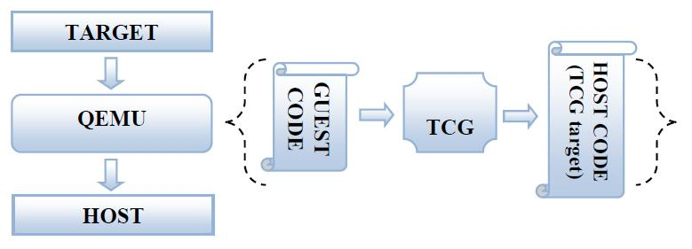
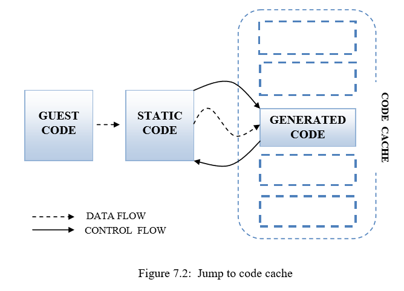
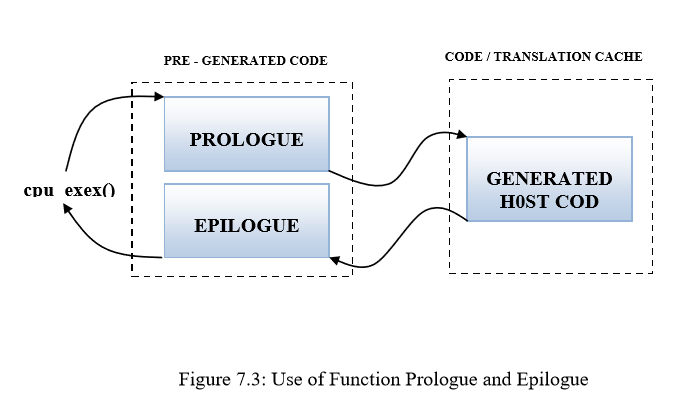
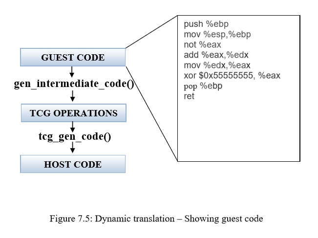
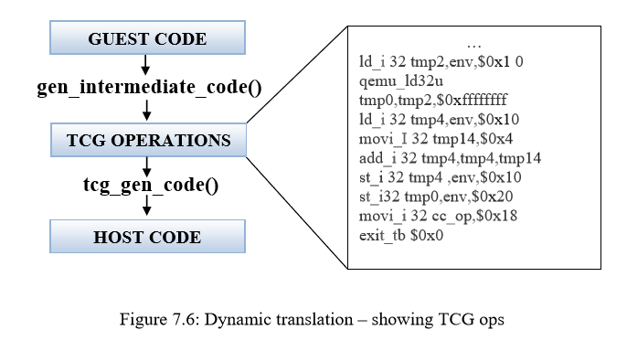
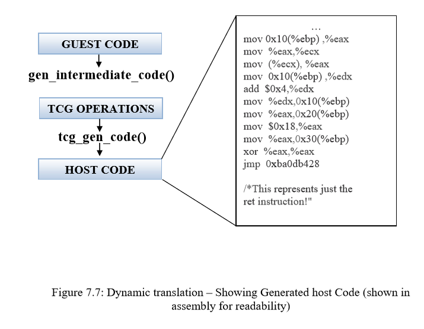
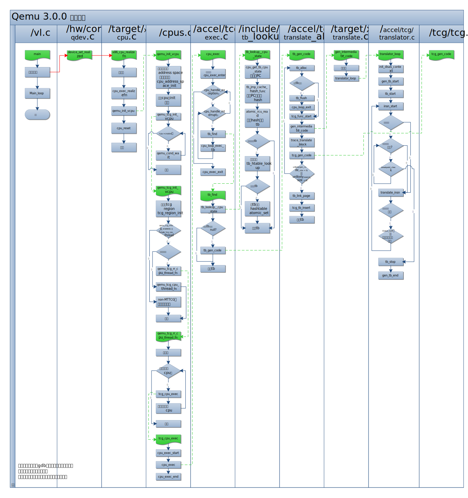

# 基础知识

主要翻译自qemu detailed study，只有第7章，其他章节没找到。这篇文章应该是基于v0.13.x版本写的，和现有的构架有很多不同，所以有些部分做了修改。

其他资料：
[各种姿势折腾 QEMU](https://blog.csdn.net/kids412kelly/article/details/52509670)

[qemu源码架构](https://blog.csdn.net/dj0379/article/details/54926443)

[QEMU开发新的架构一](https://blog.csdn.net/ivanx_cc/article/details/46122783)

[QEMU代码分析（1）－module_init()构造函数](https://blog.csdn.net/miaohongyu1/article/details/25954005)

[关于qemu的二三事（5）————qemu源码分析之参数解析](https://blog.csdn.net/Benjamin_Xu/article/details/72824904)

## 基本概念

QEMU模拟的架构叫`target`，运行QEMU的系统架构叫`host`。虚拟机(target)代码的动态生成通过一个角TCG(Tiny Code Generator)的模块完成。TCG生成被虚拟机执行的代码，因此被TCG生成的代码叫做TCG的target（这里的target和前面qemu的target不一样）。



运行在虚拟处理器上的代码（操作系统+用户工具）叫做guest code。qemu解析guest code并将其转换为host specific code（这里保留host，guest的叫法，翻译成中文了容易混淆）。整个转换的任务包含两部分：

* 首先是将一段target代码（就是guest code），也叫Translation Block(TB)，转换为TCG操作，一种与体系结构无关的中间代码。
* 然后这个TB对应的TCG根据host构架被转换成对应的host code，过程中会执行一些优化策略。

## 代码构架

1. 程序入口。主要的文件包括/vl.c,/cpus.c, /execall.c, /exec.c, /cpu-exec.c。`main`函数在/vl.c中，这个文件中的其他函数设置了虚拟机的其他参数，例如ram大小，cpu数量等。在虚拟机设置完成后，`main`函数会调用其他文件中的函数例如/cpus.c, /exec-all.c, /exec.c, /cpu-exec.c（execution branches out through files such as /cpus.c, /exec-all.c, /exec.c, /cpu-exec.c.） （main函数在2910行）

1. 硬件模拟。所有模拟虚拟硬件的代码都放在/hw/中。

1. Guest (Target) Specific: 现在QEMU中已经模拟的处理器结构包括Alpha, ARM, Cris, i386, M68K, PPC, Sparc, Mips, MicroBlaze, S390X and SH4。将这些结构的TB转换为TCG操作的代码实现在/target/arch/中（添加新的结构应该就在这里），例如i386构架的代码在/target/i386/。这部分代码叫TCG前端（frontend of TCG）.。

1. Host (TCG) Specific: 从TCG操作中生成主机代码的代码在/tcg/host_arch/中，例如i386构架的代码在/tcg/i386/。这部分代码叫做TCG后端（backend of TCG）。 

1. 总结。

   * /vl.c : 主模拟器循环，虚拟机设置和CPU执行（The main emulator loop, the virtual machine is  setup and CPUs are executed）。

   * /target/xyz/translate.c : 将客户端代码（客户端指令集）转换成与指令集构架无关的TCG操作。

   * /tcg/tcg.c : TCG的主循环.  

   * /tcg/*/tcg-target.c :  将TCG操作转换为本机ISA代码。 

   * /cpu-exec.c :  函数cpu-exec()寻找下一个TB，如果没有找打，则生成未找到TB的信号来产生一个新TB，最后执行生成的代码（应该是从TB->TCG，执行的是TCG？）。 cpu-exec() finds the next translation block (TB), if not found calls are made to generate the next TB  and finally to execute the generated code. 

## TCG-动态翻译

QEMU v0.9.1版本之前动态翻译都是由DynGen完成的。TB被DynGen转换为C代码，再由GCC将C代码转换为主机代码(host specific code)。为了解除与GCC的紧密联系，产生了一种新机制:TCG。

动态翻译使得代码再需要时才被转换。这个思想的主要目的是用最多的时间去执行生成后的代码而不是去生成代码(The idea was to spend the maximum time executing the generated code that executing the code generation)。每当从TB转换为代码（应该指的是TCG）后，这些代码会再执行前先被存储起来。多数时候相同的TB会被多次调用，这样通过本地引用（Locality Reference）可以重复使用之前转换好的代码。当指令缓存(code cache)填满时，整个缓存会被清空而不是使用LRU算法（least recently used，缓存淘汰算法）。



> 下面这一段说的是一般的编译过程，为了和tcg做对比

在执行前编译器从源代码(source code)中生成结果代码(object code)。为了生成一个函数调用的结果代码，编译器（例如GCC）会在函数调用之前和之后插入一些特殊的汇编码（assembly code），这些汇编码称作Function Prologue and Epilogue。

如果体系结构（应该指的是target的结构）有一个基指针和一个栈指针，则Function Prologue通常执行以下操作：

1. 将当前基指针压入栈中，以便后续恢复。
1. 将旧的基指针替换为当前栈指针，这样新栈会在旧栈的顶端产生。（应该是将基指针指向栈顶） Replaces the old base pointer with the current stack pointer such that the a new stack will be created on top of the old stack. 
1. 将栈指针向当前栈顶移动，给函数中的局部变量在栈中腾出存储空间。Moves the stack pointer further along the stack to make room in the current stack frame for the function's local variables. 

Function Epilogue恢复 function prologue执行的操作，并将控制权交会调用它的函数（ and returns control to the calling function，应该是只qemu的CPU调用循环）。它通常执行以下操作: 

1. 将栈指针替换为当前基指针，这样栈指针就恢复成prologue之前的值。
1. 将之前的基指针出栈，这样基指针就恢复成prologue之前的值。
1. 弹出之前的程序指针并跳转，回到之前调用的函数。（Returns to the calling function, by popping the previous frame's program counter off the stack and jumping to it）

TCG可以被看作一个生成object code的编译器。通过TCG生成的代码存储在缓存(code buffer)中，通过TCG的 Prologue和Epilogue功能来执行code buffer中的代码或者从中跳出（The execution control is passed to and from the code cache through TCG’s very on Prologue and Epilogue）。执行的流程见下图



下面4幅图介绍了TCG是如何工作的：

<figure class="half">


</figure>

<figure class="half">


</figure>
## TB链（Chaining of TBs）

从code cache返回到静态代码（QEMU程序），或者跳转到code cache通常都十分缓慢。为了解决这一问题，QEMU将每一个TB都链接到下一个TB。这样在执行完一个TB后会直接执行下一个TB而不是返回静态代码（QEMU程序）。当不存在链接(no chaining)的TB1执行完返回静态代码后，紧接着发现、转换、执行了TB2，那么当TB2返回时就会被自动的链接到TB1上。这样下次TB1执行完成后就会直接执行TB2，而不返回静态代码。如下图所示。


## 执行过程

qemu基本的执行流程可以参加下图，图中最上部分表格表示所对应的文件位置，绿色方框代表函数，浅蓝色方框代表执行流程，红色连接线代表尚未完全清楚的调用关系，蓝色连接线代表程序执行流程，绿色虚线代表将函数执行的过程展开描述。



### main `{/vl.c}`

main函数解析命令行输入参数，本根据参数设置虚拟机(VM)，例如ram，磁盘大小，启动盘等。当VM设置完成后，main()调用main_loop()。
qemu_init_cpu_list();
qemu_init_cpu_loop();

main函数和主要的执行过程cpu_exec之间的调用关系并没有完全明确，通过gdb调试，可以得到如下的调用堆栈：

```shell
#0  0x0000555555850801 in qemu_tcg_init_vcpu (cpu=0x555556b54fc0) at /home/liwb/qemu/cpus.c:1854
#1  0x0000555555850df7 in qemu_init_vcpu (cpu=0x555556b54fc0) at /home/liwb/qemu/cpus.c:2007
#2  0x000055555594ca35 in x86_cpu_realizefn (dev=0x555556b54fc0, errp=0x7fffffffd780) at /home/liwb/qemu/target/i386/cpu.c:4996
#3  0x0000555555a7fd4d in device_set_realized (obj=0x555556b54fc0, value=true, errp=0x7fffffffd958) at /home/liwb/qemu/hw/core/qdev.c:826
#4  0x0000555555c6e4d3 in property_set_bool (obj=0x555556b54fc0, v=0x55555699a3a0, name=0x555555ebb4c0 "realized", opaque=0x555556a2ad60, errp=0x7fffffffd958)
    at /home/liwb/qemu/qom/object.c:1984
#5  0x0000555555c6c74f in object_property_set (obj=0x555556b54fc0, v=0x55555699a3a0, name=0x555555ebb4c0 "realized", errp=0x7fffffffd958) at /home/liwb/qemu/qom/object.c:1176
#6  0x0000555555c6f810 in object_property_set_qobject (obj=0x555556b54fc0, value=0x5555569ea9e0, name=0x555555ebb4c0 "realized", errp=0x7fffffffd958)
    at /home/liwb/qemu/qom/qom-qobject.c:27
#7  0x0000555555c6ca34 in object_property_set_bool (obj=0x555556b54fc0, value=true, name=0x555555ebb4c0 "realized", errp=0x7fffffffd958) at /home/liwb/qemu/qom/object.c:1242
#8  0x0000555555916215 in pc_new_cpu (typename=0x555555ebbe6c "qemu64-x86_64-cpu", apic_id=0, errp=0x5555567680d8 <error_fatal>) at /home/liwb/qemu/hw/i386/pc.c:1107
#9  0x0000555555916480 in pc_cpus_init (pcms=0x555556870950) at /home/liwb/qemu/hw/i386/pc.c:1155
#10 0x000055555591aa50 in pc_init1 (machine=0x555556870950, host_type=0x555555ebc844 "i440FX-pcihost", pci_type=0x555555ebc83d "i440FX")
    at /home/liwb/qemu/hw/i386/pc_piix.c:153
#11 0x000055555591b659 in pc_init_v3_0 (machine=0x555556870950) at /home/liwb/qemu/hw/i386/pc_piix.c:438
#12 0x0000555555a882fc in machine_run_board_init (machine=0x555556870950) at /home/liwb/qemu/hw/core/machine.c:830
#13 0x00005555559d5aa4 in main (argc=3, argv=0x7fffffffde48, envp=0x7fffffffde68) at /home/liwb/qemu/vl.c:4516
```

首先是main函数启动后，在进行一系列初始化的过程中调用了qemu_tcg_init_vcpu。这里可以发现这些函数之间的调用大多是通过函数指针进行的，但是没有找到具体给函数指针赋值的位置，因此也无从确认函数之间的调用关系，只能通过调用堆栈印证。

然后观察cpu_exec的调用堆栈，可以推断cpu_exec和qemu_tcg_rr_cpu_thread_fn运行同一个线程中，这个线程不同于main函数所在线程，这个线程应该就是在qemu_tcg_init_vcpu中创建的。

```shell
Thread 6 "qemu-system-x86" hit Breakpoint 4, cpu_exec (cpu=0x555556b537c0) at /home/liwb/qemu/accel/tcg/cpu-exec.c:656
(gdb) bt
#0  0x00005555558aab2c in cpu_exec (cpu=0x555556b537c0) at /home/liwb/qemu/accel/tcg/cpu-exec.c:656
#1  0x000055555584fbb6 in tcg_cpu_exec (cpu=0x555556b537c0) at /home/liwb/qemu/cpus.c:1363
#2  0x000055555584fe0c in qemu_tcg_rr_cpu_thread_fn (arg=0x555556b537c0) at /home/liwb/qemu/cpus.c:1463
#3  0x0000555555dac9b7 in qemu_thread_start (args=0x555556a73fe0) at /home/liwb/qemu/util/qemu-thread-posix.c:504
#4  0x00007ffff25166db in start_thread (arg=0x7fffc89d6700) at pthread_create.c:463
#5  0x00007ffff223f88f in clone () at ../sysdeps/unix/sysv/linux/x86_64/clone.S:95
```


### main_loop `{/vl.c}`

[Function main_loop initially calls qemu_main_loop_start() and then does infinite looping of cpu_exec_all() and profile_getclock() within a do-while for which the condition is vm_can_run(). The infinite for-loop continues with checking some VM halting situations like qemu_shutdown_requested(), qemu_powerdown_requested(), qemu_vmstop_requested() etc. These halting conditions will not be investigated further.] 

上文是早期版本的函数解释，v3.0已经不是这个结构，代码如下：

``` C
static void main_loop(void)
{
#ifdef CONFIG_PROFILER
    int64_t ti;
#endif
    while (!main_loop_should_exit()) {
#ifdef CONFIG_PROFILER
        ti = profile_getclock();
#endif
        main_loop_wait(false);
#ifdef CONFIG_PROFILER
        dev_time += profile_getclock() - ti;
#endif
    }
}
```

可以发现，出去profiler后，内部就是一个while循环，调用`main_loop_wait`

1. main_loop_should_exit()检查是否退出循环，main_loop_should_exit()中检查了runstate_check(),qemu_debug_requested(),qemu_suspend_requested(),qemu_shutdown_requested(),qemu_kill_report(),qapi_event_send_shutdown()...等信号
1. main_loop_wait(){/include/qemu/main-loop.h,/util/main-loop.c}是循环执行内容。
   调用函数
    - main_loop_wait()
      - g_array_set_size() 未找到定义位置，g_代表全局函数？，有很多g_array_xxx()，处理数组用的？
      - slirp_pollfds_fill() {slirp/libslirp.h, slirp/slirp.c}
      - qemu_soonest_timeout() {/include/qemu/timer.h} Calculates the soonest of two timeout values. -1 means infinite, which is later than any other value.
        - timerlistgroup_deadline_ns() {/include/qemu/timer.h} Determine the deadline of the soonest timer to expire associated with any timer list linked to the timer list group. Only clocks suitable for deadline calculation are included.
      - os_host_main_loop_wait(){/util/main-loop.c} 根据操作系统不同，有2个函数。
      - slirp_pollfds_poll()
      - qemu_start_warp_timer() {/cpus.c} 
      - qemu_clock_run_all_timers() {/include/qemu/timer.h} Run all the timers associated with the default timer list of every clock.

并不清楚在main_loop_wait中具体的作用。

### xxx_cpu_realizefn() `{/target/xxx/cpu.c}`

每个target下都有这个函数，具体内容各不相同，但都先后效用了下面两个函数

1. cpu_exec_realizefn 猜测应该是cpu实例化的函数
1. qemu_init_vcpu 初始化vcpu，vcpu是虚拟cpu？cpu指的是target的cpu，那么vcpu是指运行在实体机上的cpu被用来执行tcg指令的？
1. cpu_reset cpu重置

### cpu_exec_realizefn() `{/exec.c}`

1. cpu_list_add(cpu); {/cpu-commons.c} 将当前cpu添加到cpulist， 给cpu->cpu_index = cpu_get_free_index()赋值了一个新的序号

1. if (tcg_enabled() && !tcg_target_initialized)  

   * {/qemo-common.h}中的一个宏定义，如果启用了tcg则`#define tcg_enabled() (tcg_allowed)`
   * tcg_allowed是一个全局变量，在tcg_exec_init{/accel/tcg/translate-all.c}中赋值为true，该函数在main()中被调用。

1. cc->tcg_initialize(); 

   * cc是CPUClass{/include/qom/cpu.h}类型，详情可以参见其中注释

   * tcg_initialize是一个虚函数，在不同的target中被赋值为不同的函数。

   * 在openrisc中的tcg_initialize是openrisc_translate_init{/target/openrisc/translate.c}，函数中定义了许多TCGv类型的全局变量，应该是供tcg调用的

   * TCGv{/tcg/tcg.h}类型，根据系统不同为32或者64位integer

     > Note that there is no definition of the structs TCGv_i32_d etc anywhere. This is deliberate, because the values we store in variables of type TCGv_i32 are not really pointers-to-structures. They're just small integers, but keeping them in pointer types like this means that the compiler will complain if you accidentally pass a TCGv_i32 to a  function which takes a TCGv_i64, and so on. Only the internals of TCG need to care about the actual contents of the types.

### qemu_init_vcpu() `{/cpus.c}`

1. CPUState *cpu, CPUState{/include/qom/cpu.h}是`State of one CPU core or thread.`
1. cpu->as 到第一个AddressSpace的指针，`Pointer to the first AddressSpace, for the convenience of targets which only have a single AddressSpace`
1. if (!cpu->as) {...} 如果没有AddressSpace，那么将cpu的AddressSpace数设为1，然后新建一个AddressSpace。
1. 根据kvm_enabled、hax_enabled、hvf_enabled、tcg_enabled、whpx_enabled选择init方式，这里调用了qemu_tcg_init_vcpu()
1. while (!cpu->created) {...qemu_cond_wait...} 等待直到cpu->created

### qemu_tcg_init_vcpu `{/cpus.c}`

观察qemu_tcg_init_vcpu函数的代码，可以找到如下段落：

```C++
if (qemu_tcg_mttcg_enabled()) {
    /* create a thread per vCPU with TCG (MTTCG) */
    parallel_cpus = true;
    snprintf(thread_name, VCPU_THREAD_NAME_SIZE, "CPU %d/TCG",
            cpu->cpu_index);

    qemu_thread_create(cpu->thread, thread_name, qemu_tcg_cpu_thread_fn,
                        cpu, QEMU_THREAD_JOINABLE);

} else {
    /* share a single thread for all cpus with TCG */
    snprintf(thread_name, VCPU_THREAD_NAME_SIZE, "ALL CPUs/TCG");
    qemu_thread_create(cpu->thread, thread_name,
                        qemu_tcg_rr_cpu_thread_fn,
                        cpu, QEMU_THREAD_JOINABLE);

    single_tcg_halt_cond = cpu->halt_cond;
    single_tcg_cpu_thread = cpu->thread;
}
```

这些代码根据模式不同使用了单线程或者多线程tcg。然后通过qemu_thread_create函数创建了tcg的运行线程。

### qemu_tcg_rr_cpu_thread_fn `{/cpus.c}`

1. 函数注释

   ```C
   /* Single-threaded TCG
   *
   * In the single-threaded case each vCPU is simulated in turn. If
   * there is more than a single vCPU we create a simple timer to kick
   * the vCPU and ensure we don't get stuck in a tight loop in one vCPU.
   * This is done explicitly rather than relying on side-effects
   * elsewhere.
   */
   ```

1. 初始化

   * assert(tcg_enabled()); 确保tcg启用

   * rcu_register_thread(); {/util/rcu.c} 注册rcg,代码中注释：Reader thread registration，不清楚rcu是什么

   * tcg_register_thread();

     ```C
     /*
     * All TCG threads except the parent (i.e. the one that called tcg_context_init
     * and registered the target's TCG globals) must register with this function
     * before initiating translation.
     *
     * In user-mode we just point tcg_ctx to tcg_init_ctx. See the documentation
     * of tcg_region_init() for the reasoning behind this.
     *
     * In softmmu each caller registers its context in tcg_ctxs[]. Note that in
     * softmmu tcg_ctxs[] does not track tcg_ctx_init, since the initial context
     * is not used anymore for translation once this function is called.
     *
     * Not tracking tcg_init_ctx in tcg_ctxs[] in softmmu keeps code that iterates
     * over the array (e.g. tcg_code_size() the same for both softmmu and user-mode.
     */
     ```

   * while (first_cpu->stopped) {} 应该是循环等待所有CPU初始化完成

     ``` C
     /* wait for initial kick-off after machine start */
     while (first_cpu->stopped) {
         qemu_cond_wait(first_cpu->halt_cond, &qemu_global_mutex);
     
         /* process any pending work */
         CPU_FOREACH(cpu) {
             current_cpu = cpu;
             qemu_wait_io_event_common(cpu);
         }
     }
     ```

     这里的first_cpu {/include/qom/cpu.h}是一个宏定义，从CPU队列里得到第一个CPU，`#define first_cpu QTAILQ_FIRST(&cpus)`。current_cpu{/exec.c} 是一个全局变量 `__thread CPUState *current_cpu;`，其中的`__thread`没有查到是什么意思

1. start_tcg_kick_timer() 函数注释中说的`don't get stuck in a tight loop in one vCPU`所用到的timer，这里是timer启动，后面如何判断不会超时的代码没有发现。

1. while(1)循环，应该会反复执行，没有发现break的条件

   * 一些mutex lock操作，不清楚具体作用

   * 将当前CPU设置为first_cpu

   * 循环所有的CPU

     * atomic_mb_set(&tcg_current_rr_cpu, cpu);

     * if (cpu_can_run(cpu)) 如果当前cpu可以执行

       * r = tcg_cpu_exec(cpu); 执行tcg代码
       * 返回值r的相关宏定义在{/include/exec/cpu-all.h}

       ```C
       #define EXCP_INTERRUPT 	0x10000 /* async interruption */
       #define EXCP_HLT        0x10001 /* hlt instruction reached */
       #define EXCP_DEBUG      0x10002 /* cpu stopped after a breakpoint or singlestep */
       #define EXCP_HALTED     0x10003 /* cpu is halted (waiting for external event) */
       #define EXCP_YIELD      0x10004 /* cpu wants to yield timeslice to another */
       #define EXCP_ATOMIC     0x10005 /* stop-the-world and emulate atomic */
       ```

       * if (r == EXCP_DEBUG) cpu_handle_guest_debug() {/cpus.c} 处理debug相关
       * if (r == EXCP_ATOMIC) cpu_exec_step_atomic() {/accel/tcg/cpu-exec.c} 原子性相关，不清楚具体含义

     * if (cpu->stop)

       * if (cpu->unplug) cpu = CPU_NEXT(cpu);
       * break 跳出循环，不清楚为什么一个cpu停止就要跳出所有cpu的执行循环

     * cpu = CPU_NEXT(cpu); 执行下一个cpu

   * 不清楚这些代码在干什么

     ```C
     atomic_set(&tcg_current_rr_cpu, NULL);
     
     if (cpu && cpu->exit_request) {
         atomic_mb_set(&cpu->exit_request, 0);
     }
     
     qemu_tcg_rr_wait_io_event(cpu ? cpu : QTAILQ_FIRST(&cpus));
     deal_with_unplugged_cpus();
     ```

1. rcu_unregister_thread() 和初始化时注册rcu线程对应

### tcg_cpu_exec `{/cpus.c}`

1. cpu_exec_start(cpu);{/cpu-common.c}  

   ```C
   /* Wait for exclusive ops to finish, and begin cpu execution. */
   ```

1. ret = cpu_exec(cpu); {/accel/tcg/cpu-exec.c} 主要执行循环

1. cpu_exec_end(cpu);{/cpu-common.c} 

   ```C
   /* Mark cpu as not executing, and release pending exclusive ops.  */
   ```

### cpu_handle_guest_debug

todo

### cpu_exec_step_atomic

todo

### cpu_exec `{/accel/tcg/cpu-exec.c}`

todo: here

1. 输入参数时`CPUState`{/include/qom/cpu.h}

1. cc->cpu_exec_enter(cpu); Callback for cpu_exec preparation. 在cpu_class_init{/qom/cpu.c}中：`k->cpu_exec_enter = cpu_common_noop`。cpu_common_noop是一个空函数。

1. if (sigsetjmp(cpu->jmp_env, 0) != 0) prepare setjmp context for exception handling

1. while (!cpu_handle_exception(cpu, &ret)) if an exception is pending, we execute it here

   * while (!cpu_handle_interrupt(cpu, &last_tb)) 处理中断

     * tb = tb_find(cpu, last_tb, tb_exit, cflags); 查找tb

     * cpu_loop_exec_tb(cpu, tb, &last_tb, &tb_exit); 执行tb

     * align_clocks(&sc, cpu); 对齐host和虚拟时钟

       ```C
       /* Try to align the host and virtual clocks if the guest is in advance */
       ```

1. cc->cpu_exec_exit(cpu); 和cpu_exec_enter一样，也是cpu_common_noop，空函数。

### cpu_handle_exception `{/accel/tcg/cpu-exec.c}`

todo

### cpu_handle_interrupt `{/accel/tcg/cpu-exec.c}`

todo

### cpu_loop_exec_tb `{/accel/tcg/cpu-exec.c}`

执行tb生成的host代码，主要调用的函数

- cpu_tb_exec
- cpu_exec_nocache

### tb_find `{/accel/tcg/cpu-exec.c}`

1. tb = tb_lookup__cpu_state(cpu, &pc, &cs_base, &flags, cf_mask); 查找对应的tb

1. 如果未找到，则生成tb，再将生成的tb加入到lookup表中。

   ```C
   if (tb == NULL) {
       mmap_lock();
       tb = tb_gen_code(cpu, pc, cs_base, flags, cf_mask);
       mmap_unlock();
       /* We add the TB in the virtual pc hash table for the fast lookup */
       atomic_set(&cpu->tb_jmp_cache[tb_jmp_cache_hash_func(pc)], tb);
   }
   ```

1. 处理跳转相关，这里的last_tb是再cpu_exec中经过cpu_handle_interrupt(cpu, &last_tb)处理过的，tb_exit=0， 不清除具体功能

   ```C
   if (last_tb && !qemu_loglevel_mask(CPU_LOG_TB_NOCHAIN)) {
       tb_add_jump(last_tb, tb_exit, tb);
   }
   ```

### tb_lookup__cpu_state `{/include/exec/tb_lookup.h}`

1. cpu_get_tb_cpu_state(env, pc, cs_base, flags) 调用cpu_get_tb_cpu_state，根据cpu不同，执行不同函数，获取当前cpu的PC, Flags等等。      

1. 然后根据pc值找到对应的tb

   ``` C
   hash = tb_jmp_cache_hash_func(*pc);
   tb = atomic_rcu_read(&cpu->tb_jmp_cache[hash]);
   ```

   * `tb_jmp_cache_hash_func`是通过pc值从hash表中找到索引的函数。(This is a hash function to find offset of TB in tb_jmp_cache using the PC as key)
   * 当一个tb存储在tb_jmp_cache中时，可以直接通过通过pc值从hash表中找到，然后代码会检查找到的tb的有效性(The code then follows to check the validity of the found TB)？

1. 检查tb有效性，如果有效则直接返回tb

   ``` C
   if (likely(tb &&
           tb->pc == *pc &&
           tb->cs_base == *cs_base &&
           tb->flags == *flags &&
           tb->trace_vcpu_dstate == *cpu->trace_dstate &&
           (tb_cflags(tb) & (CF_HASH_MASK | CF_INVALID)) == cf_mask)) {
       return tb;
   }
   ```

1. 否则更慢速查找tb

   ``` C
   tb = tb_htable_lookup(cpu, *pc, *cs_base, *flags, cf_mask);
   ```

1. 如果仍未找到，返回NULL，否则将找到的tb加入tb_jmp_cache，方便下次查找，再返回tb

   ```C
   if (tb == NULL) {
       return NULL;
   }
   atomic_set(&cpu->tb_jmp_cache[hash], tb);
   return tb;
   ```

### tb_htable_lookup `{/accel/tcg/cpu-exec.c}`

更慢速查找tb的函数

1. phys_pc是guest上的物理地址，用来查找下一个TB。phys_pc should be the physical memory address of  the Guest OS’s PC, and it is used to find the next TB through a hash function.

   ```C
   phys_pc = get_page_addr_code(desc.env, pc);
   ```

1. phys_pc计算hash，再通过hash查找tb并返回

   ```C
   h = tb_hash_func(phys_pc, pc, flags, cf_mask, *cpu->trace_dstate);
   return qht_lookup_custom(&tb_ctx.htable, &desc, h, tb_lookup_cmp);
   ```

### struct TranslationBlock `{/include/exec/exec-all.h}`

1. 下面是早期版本的解析，现在版本已经不同。

   > Structure TranslationBlock contains the following; PC, CS_BASE, Flags corresponding to this TB, tc_ptr (a pointer to the translated code of this TB), tb_next_offset[2], tb_jmp_offset[2] (both to find the TBs chained to this TB. ie. the TB that follows this TB), *jmp_next[2], *jmp_first (points to the TBs that jump into this TB).

1. TB包含以下内容：

   * 这个TB对应的PC, CS_BASE, Flags；

   * struct tb_tc tc; Translation Cache相关的指针

     ```C
     /*
     * Translation Cache-related fields of a TB.
     * This struct exists just for convenience; we keep track of TB's in a binary
     * search tree, and the only fields needed to compare TB's in the tree are
     * @ptr and @size.
     * Note: the address of search data can be obtained by adding @size to @ptr.
     */
     ```

   * 指向代码页的指针，这里应该是指的target代码？

     ```C
     /* first and second physical page containing code. The lower bit
     of the pointer tells the index in page_next[].
     The list is protected by the TB's page('s) lock(s) */
     uintptr_t page_next[2];
     tb_page_addr_t page_addr[2];
     ```

   * 用来跳转到其他TB的指针，最多支持两个跳转方向。

     ```C
     /* The following data are used to directly call another TB from
     * the code of this one. This can be done either by emitting direct or
     * indirect native jump instructions. These jumps are reset so that the TB
     * just continues its execution. The TB can be linked to another one by
     * setting one of the jump targets (or patching the jump instruction). Only
     * two of such jumps are supported.
     */
     uint16_t jmp_reset_offset[2]; /* offset of original jump target */
     #define TB_JMP_RESET_OFFSET_INVALID 0xffff /* indicates no jump generated */
     uintptr_t jmp_target_arg[2];  /* target address or offset */
     ```

     按照注释的描述，jmp_reset_offset是在跳转reset时使用的，应该是跳转到这个TB的TB地址。但是后面又有一组指针来专门存储incoming jumps，这样来看，reset的时候就时跳回当前TB，但这样jmp_reset_offset的含义就很奇怪，因为没有必要存储自己的地址。

   * jmp_list_head是所有incoming jumps组成的列表的头（很奇怪，为什么要用链表来存这些？），链表用NULL结尾。每个TB有两个跳转方向，因此就可能出现在两个list中，这些list的入口存储在jmp_list_next[2]中，指针的最低有效位用来表示哪个list是真正指向（下一个）TB的。jmp_dest[]用来存储所有的outgoing jump，是tagged指针（含义？）

     ```C
     /*
     * Each TB has a NULL-terminated list (jmp_list_head) of incoming jumps.
     * Each TB can have two outgoing jumps, and therefore can participate
     * in two lists. The list entries are kept in jmp_list_next[2]. The least
     * significant bit (LSB) of the pointers in these lists is used to encode
     * which of the two list entries is to be used in the pointed TB.
     *
     * List traversals are protected by jmp_lock. The destination TB of each
     * outgoing jump is kept in jmp_dest[] so that the appropriate jmp_lock
     * can be acquired from any origin TB.
     *
     * jmp_dest[] are tagged pointers as well. The LSB is set when the TB is
     * being invalidated, so that no further outgoing jumps from it can be set.
     *
     * jmp_lock also protects the CF_INVALID cflag; a jump must not be chained
     * to a destination TB that has CF_INVALID set.
     */
     uintptr_t jmp_list_head;
     uintptr_t jmp_list_next[2];
     uintptr_t jmp_dest[2];
     ```

     整个这段注释都没有十分的理解，和上一段一样，感觉不清楚在说什么。

### tb_gen_code `{/accel/tcg/translate_all.c}`

1. 创建一个新tb

   ```C
   phys_pc = get_page_addr_code(env, pc);    
   tb = tb_alloc(pc);
   ```

   * Function tb_gen_code starts with allocating   ( tb_alloc() ) a new TB, the PC for the TB is found from the PC of CPUState using get_page_addr_code(). 

   * get_page_addr_code{/include/exec/exec-all.h} 函数定义如下，

     ```C
     static inline tb_page_addr_t get_page_addr_code(CPUArchState *env1, target_ulong addr)
     {
         return addr;
     }
     ```

     相当于函数直接返回了pc，并没有发现phys_pc在哪里被使用，tb_alloc时使用的还是当前pc值。

1. 检查新建从tb有效性，如果无效则直接生成中断，并退出

   ```C
   if (unlikely(!tb)) {
       /* flush must be done */
       tb_flush(cpu);
       mmap_unlock();
       /* Make the execution loop process the flush as soon as possible.  */
       cpu->exception_index = EXCP_INTERRUPT;
       cpu_loop_exit(cpu);
   }
   ```

1. 给新建的tb赋值

   ```C
   gen_code_buf = tcg_ctx->code_gen_ptr;
   tb->tc.ptr = gen_code_buf;
   tb->pc = pc;
   tb->cs_base = cs_base;
   tb->flags = flags;
   tb->cflags = cflags;
   tb->trace_vcpu_dstate = *cpu->trace_dstate;
   tcg_ctx->tb_cflags = cflags;
   ```

   其中tcg_ctx的声明为`extern __thread TCGContext *tcg_ctx;`{/tcg/tcg.h}，没有找到定义的地方。

1. tcg_func_start() {/tcg/tcg.c}，为tcg_ctx分配了内存，还有些初始化操作，其他功能未知。

1. 将target代码转换到tcg代码，前后分别给tcg_ctx->cpu赋值不清楚意义何在

   ```C
   tcg_ctx->cpu = ENV_GET_CPU(env);
   gen_intermediate_code(cpu, tb);
   tcg_ctx->cpu = NULL;
   ```

1. trace_translate_block(tb, tb->pc, tb->tc.ptr) 
   未找到...

1. tcg_gen_code(tcg_ctx, tb) {/tcg/tcg.c} 从tcg转换为host执行的代码

1. tb_link_page(tb, phys_pc, phys_page2) `{/accel/tcg/translate_all.c}`

   ```C
   /* add a new TB and link it to the physical page tables. phys_page2 is
   * (-1) to indicate that only one page contains the TB.
   *
   * Called with mmap_lock held for user-mode emulation.
   *
   * Returns a pointer @tb, or a pointer to an existing TB that matches @tb.
   * Note that in !user-mode, another thread might have already added a TB
   * for the same block of guest code that @tb corresponds to. In that case,
   * the caller should discard the original @tb, and use instead the returned TB.
   */
   ```

1. tcg_tb_insert(tb) `{/tcg/tcg.c}`

### gen_intermediate_code {/target/xxx/translate.c}

应该是转换guest->tcg代码。每个target下均有该函数，将target代码转换为tcg代码（generate intermediate code for basic block 'tb'）
    

1. 在translate.c文件中会定义一个xxx_xxx_ops的变量：

   TranslatorOps{/accel/tcg/translater.h}结构定义如下。`Disas`应该是disassembly的缩写。

   ``` C
   /**
   * TranslatorOps:
   * @init_disas_context:
   *      Initialize the target-specific portions of DisasContext struct.
   *      The generic DisasContextBase has already been initialized.
   *
   * @tb_start:
   *      Emit any code required before the start of the main loop,
   *      after the generic gen_tb_start().
   *
   * @insn_start:
   *      Emit the tcg_gen_insn_start opcode.
   *
   * @breakpoint_check:
   *      When called, the breakpoint has already been checked to match the PC,
   *      but the target may decide the breakpoint missed the address
   *      (e.g., due to conditions encoded in their flags).  Return true to
   *      indicate that the breakpoint did hit, in which case no more breakpoints
   *      are checked.  If the breakpoint did hit, emit any code required to
   *      signal the exception, and set db->is_jmp as necessary to terminate
   *      the main loop.
   *
   * @translate_insn:
   *      Disassemble one instruction and set db->pc_next for the start
   *      of the following instruction.  Set db->is_jmp as necessary to
   *      terminate the main loop.
   *
   * @tb_stop:
   *      Emit any opcodes required to exit the TB, based on db->is_jmp.
   *
   * @disas_log:
   *      Print instruction disassembly to log.
   */
   typedef struct TranslatorOps {
       void (*init_disas_context)(DisasContextBase *db, CPUState *cpu);
       void (*tb_start)(DisasContextBase *db, CPUState *cpu);
       void (*insn_start)(DisasContextBase *db, CPUState *cpu);
       bool (*breakpoint_check)(DisasContextBase *db, CPUState *cpu,
                               const CPUBreakpoint *bp);
       void (*translate_insn)(DisasContextBase *db, CPUState *cpu);
       void (*tb_stop)(DisasContextBase *db, CPUState *cpu);
       void (*disas_log)(const DisasContextBase *db, CPUState *cpu);
   } TranslatorOps;
   
   /**
   * DisasContextBase:
   * @tb: Translation block for this disassembly.
   * @pc_first: Address of first guest instruction in this TB.
   * @pc_next: Address of next guest instruction in this TB (current during
   *           disassembly).
   * @is_jmp: What instruction to disassemble next.
   * @num_insns: Number of translated instructions (including current).
   * @max_insns: Maximum number of instructions to be translated in this TB.
   * @singlestep_enabled: "Hardware" single stepping enabled.
   *
   * Architecture-agnostic disassembly context.
   */
   typedef struct DisasContextBase {
       TranslationBlock *tb;
       target_ulong pc_first;
       target_ulong pc_next;
       DisasJumpType is_jmp;
       int num_insns;
       int max_insns;
       bool singlestep_enabled;
   } DisasContextBase;
   ```

   这个结构体中存的都是函数指针，在每个target/translate.c文件中都会对这个结构体进行实例化，结构体中每个成员函数就是对应的功能入口，均在同一个文件中。

   ``` C
   static const TranslatorOps arm_translator_ops = {
       .init_disas_context = arm_tr_init_disas_context,
       .tb_start           = arm_tr_tb_start,
       .insn_start         = arm_tr_insn_start,
       .breakpoint_check   = arm_tr_breakpoint_check,
       .translate_insn     = arm_tr_translate_insn,
       .tb_stop            = arm_tr_tb_stop,
       .disas_log          = arm_tr_disas_log,
   };
   ```

1. 调用translator_loop{accel/tcg/translator.c,accel/tcg/translator.h}函数实现target->tcg代码的转换。

### translator_loop {accel/tcg/translator.c,accel/tcg/translator.h}

    ``` C
    /**
    * translator_loop:
    * @ops: Target-specific operations.
    * @db: Disassembly context.
    * @cpu: Target vCPU.
    * @tb: Translation block.
    *
    * Generic translator loop.
    *
    * Translation will stop in the following cases (in order):
    * - When is_jmp set by #TranslatorOps::breakpoint_check.
    *   - set to DISAS_TOO_MANY exits after translating one more insn
    *   - set to any other value than DISAS_NEXT exits immediately.
    * - When is_jmp set by #TranslatorOps::translate_insn.
    *   - set to any value other than DISAS_NEXT exits immediately.
    * - When the TCG operation buffer is full.
    * - When single-stepping is enabled (system-wide or on the current vCPU).
    * - When too many instructions have been translated.
    */
    void translator_loop(const TranslatorOps *ops, DisasContextBase *db,
                        CPUState *cpu, TranslationBlock *tb);
    ```

查看了几个target下的translator_loop函数调用，发现第二个参数db均是在gen_intermediate_code()中定义的一个空结构体。这个变量在translator_loop首先会被初始化，按照函数注释，这个变量中存储的是反汇编内容，应该指的是转换后的tcg码。但是db并没有作为返回值，应该会在函数结束后消亡，应该在translator_loop中子函数中保存了它，还需要进一步观察。

translator_loop函数结构比较简单，流程如下：

1. 初始化`DisasContext`
1. `Instruction counting` 给db->max_insns变量赋值，这个tb中的将要译码的最大指令数量
1. ops->init_disas_context(db, cpu)。 ops成员函数，对每个target会使用对应的函数。Initialize the target-specific portions of DisasContext struct. The generic DisasContextBase has already been initialized. 前面初始化的是DisasContext的公共部分，这里是对每个target调用专有的初始化函数。
1. tcg_clear_temp_count()。 /* Reset the temp count so that we can identify leaks */
1. gen_tb_start(db->tb){/exec/gen-icount.h}。这个文件中有好几个类似函数，文件注释是/* Helpers for instruction counting code generation.  */，应该是在执行过程中的辅助函数，程序计数用？
1. ops->tb_start(db, cpu)。ops成员函数，Emit any code required before the start of the main loop，after the generic gen_tb_start().没理解注释含义，待后续查看函数内容再说。
1. while循环开始，逐条开始译码。
   1. 程序计数加一，调用ops->insn_start(db, cpu)
   1. 检查调试断点，如果下一条指令是断点，调用ops->breakpoint_check(db, cpu, bp)，并结束while
   1. 调用ops->translate_insn(db, cpu)进行译码，有一个当前指令书等于最大指令数的特殊判断，不清楚具体作用
   1. 结束循环判断。一是db->is_jmp不是译码下一条指令`DISAS_NEXT`，二是tcg_op_buf_full() 或者 db->num_insns >= db->max_insns，指令数超上限
1. ops->tb_stop(db, cpu)。 Emit any opcodes required to exit the TB, based on db->is_jmp.
1. gen_tb_end(db->tb, db->num_insns);？？

下面以openrisc为例逐项解析ops中的各个函数{/target/openrisc/translate.c}
.init_disas_context = openrisc_tr_init_disas_context 新建了一个DisasContext，并对其进行了初始化赋值，不清楚具体每个参数的含义
.tb_start = openrisc_tr_tb_start 设置了寄存器R0，不知为何
.insn_start = openrisc_tr_insn_start 发出tcg_gen_insn_start指令
.breakpoint_check = openrisc_tr_breakpoint_check,设置断点，再下一条指令设置了跳转，并且将跳转类型设置为DISAS_NORETURN，没理解为什么，这样可以再程序停止运行，然后在需要继续的时候由调试器返回？
.translate_insn = openrisc_tr_translate_insn,调用了/scripts/decodetree.py，通过这个脚本生成了一个c文件，decode.inc.c，这文件中包含了译码函数decode，具体指令译码的格式在insns.decode文件中
.tb_stop = openrisc_tr_tb_stop,对于不同类型的跳转进行了分别处理
.disas_log = openrisc_tr_disas_log

### disas_arm_insn {/target/arm/translate.c}

翻译arm指令到tcg
通过gdb设置断点到该函数，可以查看到指令译码的过程，修改该译码过程后，重新编译qemu就可以得到经过自定义指令调整的qemu模拟器。

### tcg_gen_code {/tcg/tcg.c}

tcg_gen_code() {/tcg/tcg.c},将tcg代码转换为host代码，这个函数实现的是前面《TCG-动态翻译》一节描述的过程（这里是tcg->host的过程，我们要修改的是guest->tcg的过程，应该不需要更改这里的代码，没有细看）。

（既然qemu已经是c语言写的，那么在qemu编译完成后，在qemu运行过程中动态产生的tcg代码应该就可以直接被host执行了，这里的转换起什么作用？）

## tcg讲解

https://chemnitzer.linux-tage.de/2012/vortraege/1062
tcg使用方法

1. guest--需要模拟的体系机构，target--运行tcg的体系结构。
2. 直接使用qemu提供的tcg中间函数去构建自己的guest指令，将guest指令转换为tcg执行后再执行
3. 使用tcg_helper来构建复杂guest指令，tcg在运行时会直接调用对应的helper函数，这样，guest指令直接转换为c代码运行
4. tcg中间代码微指令类型总结https://blog.csdn.net/lulu901130/article/details/45716883

## 添加自定义指令

为了测试添加/修改指令，我们需要完成以下工作：

1. 编写client执行程序，即该程序需要使用qemu来模拟运行
1. 修改qemu中的指令译码部分代码，添加/修改client程序中所执行的指令所对应的代码
1. 通过gdb调试查看修改后的指令是否正确执行

### 编写程序

可以编写C程序，也可以编写汇编程序。C程序通过user方式模拟linux运行，通过gcc编译生成的代码可以通过反汇编查看；汇编程序用system方式运行，不会产生多余的代码。

这里用到的编译器都是交叉编译，即在host机器上编译guest代码

#### C程序

1. arm的交叉编译工具链可以通过`sudo apt-get install gcc-arm-linux-gnueabi`安装（https://www.cnblogs.com/muyun/p/3370996.html）

1. arm-linux-gnueabi-gcc 编译器gcc，和gcc用法相同，将c代码编译成可执行文件。

1. arm-linux-gnueabi-objdump 反汇编，将编译好的程序dump成汇编码
   `arm-linux-gnueabi-objdump -S hello > dump1.txt`
   反汇编后的程序显示为如下格式

   ```
   ...
   000103fc <main>:
   103fc:	e92d4800 	push	{fp, lr}
   10400:	e28db004 	add	fp, sp, #4
   10404:	e59f000c 	ldr	r0, [pc, #12]	; 10418 <main+0x1c>
   10408:	ebffffb3 	bl	102dc <puts@plt>
   1040c:	e3a03000 	mov	r3, #0
   10410:	e1a00003 	mov	r0, r3
   10414:	e8bd8800 	pop	{fp, pc}
   10418:	0001048c 	.word	0x0001048c
   ...
   ```

   其中机器码部分为little edian，即e9 2d 48 00 在程序二进制中存储为00 48 2d e9，通过二进制编辑器打开可执行程序可以找到每行机器码所在位置。

1. 使用qemu-arm运行生成好的执行文件

#### 汇编程序

参考https://www.anquanke.com/post/id/86383，主要使用arm-linux-gnueabi-as、arm-linux-gnueabi-gcc、arm-linux-gnueabi-ld工具

1. 测试用的汇编程序代码如下，保存为test.s文件

   ``` 
   .global   _start
   _start: 
       mrs  r0, cpsr  # 将状态寄存器CPSR中的内容传送至R0
       bic  r0, #0x1f # Rd,  Rn, Oprand2 
       # BIC（位清除）指令对 Rn 中的值 和 Operand2 值的反码按位进行逻辑“与”运算。 (注意:ARM官方网站有误, 写的是补码)
       # BIC 是 逻辑”与非” 指令, 实现的 Bit Clear的功能
       orr  r0, #0x12
       msr  cpsr, r0
       nop
       b  end
   
   .end
   ```

1. 汇编
   `arm-linux-gnueabi-gcc test.s -o test.o -c -g`

1. ld
   `arm-linux-gnueabi-ld -Ttext 0x00000000  test.o -o test.elf`

1. 运行
   `./qemu-system-arm -machine vexpress-a9 -m 256M -serial stdio -kernel test.elf -S -s`

    -machine vexpress-a9：指定开发板，该开发板是QEMU中支持的一款ARM公司的基于Cortex-A9的开发板
    -m 256M：指定物理内存的大小
    -serial stdio：指定串口为标准输入输出
    -kernel test.elf：指定要运行的elf格式的可执行文件
    -S：虚拟机启动后立即暂停,等侍gdb连接, “freeze CPU at start up”
    -s：在1234接受gdb调试连接

1. 调试
   这里用的是交叉编译后的调试arm版gdb（参加后文gdb交叉编译）
   `arm-none-linux-gnueabi-gdb  test.elf`

1. 然后连接远程
   `target  remote  localhost:1234`

1. 图形界面
   `sudo apt-get install ddd` 安装ddd
   `ddd --debugger ./arm-none-linux-gnueabi-gdb test.elf` 用ddd调用arm版gdb调试程序

    这里可以看见汇编码，以及对应的机器码，并可以单步执行，执行结果可以通过查看寄存器看到。

1. 参考资料：
   qemu进行ARM CPU仿真及程序gdb调试 https://blog.csdn.net/ass_dsb/article/details/78744614?utm_source=blogxgwz5

   qemu+arm-linux-gdb模拟运行ARM程序 http://emb.hqyj.com/Column/3657.html

1. 机器码
   arm-linux-gnueabi-objcopy -O binary -S test.elf test.bin 变成纯机器码，二进制打开后可以和汇编指令一一对应
   执行 ./qemu-system-arm -machine vexpress-a9 -m 256M -serial stdio -kernel test.bin -S -s 后，用gdb连接调试，并单步执行，可以发现qemu先执行了一些其他指令（不清楚内容，也不清楚从哪里来的），然后跳转到新的内存地址，开始test.bin对应的程序，ddd的machine code window可以看见对应的机器码以及汇编指令，可以单步执行这些指令

### 添加/修改指令

通过调试qemu可以找到指令译码的函数

1. 启用调试（这里用的是系统自带的gdb，用来调试qemu程序本身）
   `gdb --args ./qemu-system-arm -machine vexpress-a9 -m 256M -serial stdio -kernel test.elf -S -s`

1. 设置断点，通过代码分析，已经知道arm译码函数是disas_arm_insn，因此执行
   `break disas_arm_insn`

1. `run`开始程序执行（模拟器界面弹出后默认是暂停状态，需要通过菜单结束暂停）

1. 程序执行后会触发断点，变量insn中存储的就是当前译码的执行，通过单步执行(`n`)可以找到具体译码该执行的代码，到对应qemu源代码中找到后进行修改测试（比如，bic  r0, #0x1f指令中而可以通过代码修改使之永远载入一个固定的常数）

1. 重新编译qemu

   ```
   ../configure --target-list=arm-softmmu --enable-debug --enable-debug-info
   make
   ```

1. 使用交叉编译版gdb调试test.elf，通过查看寄存器可以得知修改结果正确

1. 我只测试修改了一条指令，如果需要添加新指令，修改位置是相同的，根据tcg提供的函数来自行组织执行的执行内容

### 交叉编译gdb

参考https://www.cnblogs.com/lijinlei/p/4850432.html

1. 下载gdb，可以从官网下

1. configure 
   `./configure --target=arm-none-linux-gnueabi --program-prefix=arm-none-linux-gnueabi-  --prefix=/home/enzo --with-python`
   其中：
   --target i指明目标系统类型
   --prefix 指生成的可执行文件安装在哪个目录
   --program-prefix  指生成的可执行文件的前缀

1. make 会提示错误缺少bfd.h
   安装 `sudo apt-get install binutils-dev` 后解决问题

1. make install

1. 这样安装完成后没有安装到系统目录，以后运行时需要拷贝到对应文件夹，使用./方式运行

1. 用gdb 查看汇编代码， 采用disassemble 和 x 命令。

1. nexti, stepi 可以单步指令执行,layout src 查看源码，print查看变量值

1. 其他参考资料：
   https://blog.csdn.net/hejinjing_tom_com/article/details/26704487

   qemu+arm-linux-gdb模拟运行ARM程序 http://emb.hqyj.com/Column/3657.html

   Linux下交叉编译gdb，gdbserver+gdb的使用以及通过gdb调试core文件 https://www.cnblogs.com/lidabo/p/5645653.html

## qemu monitor

在启动 QEMU 的时候，同时也会启动 monitor 的控制台，通过这个控制台，可以与 QEMU 或者运行状态的虚拟机进行交互。虽然现在有诸如 virt-manager 之类的图形界面的虚拟机管理工具，但是在 monitor 的控制台窗口输入命令似乎更符合 Linux 程序员的开发习惯，而且还能完成一些图形化管理工具所不具备的功能。在 monitor 控制台中，可以完成很多常规操作，比如添加删除设备、虚拟机音视频截取、获取虚拟机运行状态、更改虚拟机运行时配置等等。

事实上，启动 QEMU 后通常是看不到 monitor 界面的。要进入该界面，可以在 QEMU 窗口激活的时候按住 Ctrl+Alt+2 进入，切换回工作界面需要按 Ctrl+Alt+1。另外，还可以在 QEMU 启动的时候指定 -monitor 参数。比如 -monitor stdio 将允许使用标准输入作为 monitor 命令源。这种方式和常见的 Linux 交互式的用户程序无异，所以在做测试工作的时候，可以很方便的编写出对虚拟机监控的 shell 脚本程序。

https://www.ibm.com/developerworks/cn/linux/l-cn-qemu-monitor/index.html

## 其他

1. {/target/xxx/translate.c}: guest ISA specific code. 
2. {tcg-*/*/}: host ISA specific code.
3. {linux-user/*}: Linux usermode specific code. 
4. hw/*: Hardware, including video, audio, and boards.

https://people.cs.nctu.edu.tw/~chenwj/dokuwiki/doku.php?id=qemu


# 编译

## 代码下载

下载页面：https://www.qemu.org/download/

git地址：https://git.qemu.org/?p=qemu.git， 或者：https://github.com/qemu/qemu

直接下载源码包编译会提示/tests等目录无法找到，需要从git clone

```shell
git clone git://git.qemu-project.org/qemu.git
```

还需要执行`git submodule update`下载所有的git子模块

## linux编译

代码下好后安装依赖包（ubuntu环境）

```shell
sudo apt-get install git libglib2.0-dev libfdt-dev libpixman-1-dev zlib1g-dev

sudo apt-get install libnfs-dev libiscsi-dev

sudo apt-get install git-email
sudo apt-get install libaio-dev libbluetooth-dev libbrlapi-dev libbz2-dev
sudo apt-get install libcap-dev libcap-ng-dev libcurl4-gnutls-dev libgtk-3-dev
sudo apt-get install libibverbs-dev libjpeg8-dev libncurses5-dev libnuma-dev
sudo apt-get install librbd-dev librdmacm-dev
sudo apt-get install libsasl2-dev libsdl1.2-dev libseccomp-dev libsnappy-dev libssh2-1-dev
sudo apt-get install libvde-dev libvdeplug-dev libvte-2.90-dev libxen-dev liblzo2-dev
sudo apt-get install valgrind xfslibs-dev 
```

### 代码编译

```shell
cd qemu
mkdir -p build
cd build
../configure --target-list=x86_64-softmmu,arm-softmmu --enable-debug --enable-debug-info # 只编译x86，arm版本
make
```

或者

```shell
./configure --target-list='or1k-softmmu or1k-linux-user' && make
```

编译完成后运行

```
./build/x86_64-softmmu/qemu-system-x86_64 -L pc-bios
```
或者运行linux镜像

```shell
./qemu-system-or1k -cpu or1200 -M or1k-sim -kernel or1k-linux-4.10 -serial stdio -nographic -monitor none
```

如果依赖包安装没有装完全，编译时会没有gtk支持，运行时console显示`VNC server running on 127.0.0.1:5900`，在浏览器中打开，可以看见运行结果（一行文本）。可以运行`./build/x86_64-softmmu/qemu-system-x86_64 -L pc-bios -nographic`来在console中显示。

如果运行正常，会弹出一个虚拟机界面显示运行情况。

如果编译时指定了多个target，那么编译完成后，在build目录下会有以每个target-name命名的文件夹，这个文件夹中有一个qemu-system-{target-name}的文件，就是qemu针对不同target的执行程序。
在build目录下还会有几个qemu的通用工具：

* qemu-img：创建磁盘镜像，创建出的镜像格式有[qcow](https://people.gnome.org/~markmc/qcow-image-format.html)、raw等等
* qemu-ga：这是一个不利用网络实现 guest 和 host 之间交互的应用程序（使用 virtio-serial），运行在 guest 中。
* qemu-io：这是一个执行 Qemu I/O 操作的命令行工具。
* qemu-nbd：磁盘挂载工具。

### 用户模式和系统模式

qemu-{target}和qemu-system-{target}的区别：

1. qemu-{target}是用户模式的模拟器(更精确的表述应该是系统调用模拟器)，而qemu-system-{target}则是系统模拟器，它可以模拟出整个机器并运行操作系统
2. qemu-{target}仅可用来运行二进制文件，因此你可以交叉编译完例如hello world之类的程序然后交给qemu-{target}来运行，简单而高效。而qemu-system-{target}则需要你把hello world程序下载到客户机操作系统能访问到的硬盘里才能运行。

对于下面的命令
```shell
./configure --target-list=arm-softmmu,arm-linux-user
```
会生成两个执行程序，分别是qemu-system-arm, qemu-arm

如果需要使用qemu-arm来执行自己编写的c代码：
1. 需要安装交叉编译工具`sudo apt-get install gcc-arm-linux-gnueabi`
1. 然后使用`arm-linux-gnueabi-gcc test.c -o test`
1. 最后`qemu-arm -L /usr/arm-linux-gnueabi -cpu cortex-a15 test`。如果不用-L指定库的位置，那么运行时会提示`/lib/ld-linux.so.3: No such file or directory`
1. 也可以在编译代码的时候采用静态编译，加-static


## windows编译

### mysys2

1. 安装msys2

2. 在MINGW64下安装“pacman -Sy mingw-w64-x86_64-toolchain”

3. 安装如下软件包

```shell
pacman -Sy mingw-w64-x86_64-meson mingw-w64-x86_64-ninja \
        mingw-w64-x86_64-python \
        mingw-w64-x86_64-python-sphinx \
        mingw-w64-x86_64-python-sphinx_rtd_theme \
        mingw-w64-x86_64-autotools \
        mingw-w64-x86_64-tools-git \
        mingw-w64-x86_64-cc \
        mingw-w64-x86_64-angleproject \
        mingw-w64-x86_64-capstone \
        mingw-w64-x86_64-curl \
        mingw-w64-x86_64-cyrus-sasl \
        mingw-w64-x86_64-expat \
        mingw-w64-x86_64-fontconfig \
        mingw-w64-x86_64-freetype \
        mingw-w64-x86_64-fribidi \
        mingw-w64-x86_64-gcc-libs \
        mingw-w64-x86_64-gdk-pixbuf2 \
        mingw-w64-x86_64-gettext \
        mingw-w64-x86_64-glib2 \
        mingw-w64-x86_64-gmp \
        mingw-w64-x86_64-gnutls \
        mingw-w64-x86_64-graphite2 \
        mingw-w64-x86_64-gst-plugins-base \
        mingw-w64-x86_64-gstreamer \
        mingw-w64-x86_64-gtk3 \
        mingw-w64-x86_64-harfbuzz \
        mingw-w64-x86_64-jbigkit \
        mingw-w64-x86_64-lerc \
        mingw-w64-x86_64-libc++ \
        mingw-w64-x86_64-libdatrie \
        mingw-w64-x86_64-libdeflate \
        mingw-w64-x86_64-libepoxy \
        mingw-w64-x86_64-libffi \
        mingw-w64-x86_64-libiconv \
        mingw-w64-x86_64-libidn2 \
        mingw-w64-x86_64-libjpeg-turbo \
        mingw-w64-x86_64-libnfs \
        mingw-w64-x86_64-libpng \
        mingw-w64-x86_64-libpsl \
        mingw-w64-x86_64-libslirp \
        mingw-w64-x86_64-libssh \
        mingw-w64-x86_64-libssh2 \
        mingw-w64-x86_64-libtasn1 \
        mingw-w64-x86_64-libthai \
        mingw-w64-x86_64-libtiff \
        mingw-w64-x86_64-libunistring \
        mingw-w64-x86_64-libunwind \
        mingw-w64-x86_64-libusb \
        mingw-w64-x86_64-libwebp \
        mingw-w64-x86_64-libwinpthread-git \
        mingw-w64-x86_64-lz4 \
        mingw-w64-x86_64-lzo2 \
        mingw-w64-x86_64-nettle \
        mingw-w64-x86_64-openssl \
        mingw-w64-x86_64-opus \
        mingw-w64-x86_64-orc \
        mingw-w64-x86_64-p11-kit \
        mingw-w64-x86_64-pango \
        mingw-w64-x86_64-pixman \
        mingw-w64-x86_64-SDL2 \
        mingw-w64-x86_64-SDL2_image \
        mingw-w64-x86_64-snappy \
        mingw-w64-x86_64-spice \
        mingw-w64-x86_64-usbredir \
        mingw-w64-x86_64-xz \
        mingw-w64-x86_64-zlib \
        mingw-w64-x86_64-zstd
```

4. 下载qemu源码，建立build目录，进入build目录，执行```../configure --target-list=riscv64-softmmu```

```../configure --target-list=tms320c28x-softmmu --enable-debug --enable-debug-info --disable-libnfs --disable-werror```

使用`--disable-download`选项禁用下载，否则每次都会重新下载ninjia之类的程序

### wsl2

```shell
git clone git://git.qemu.org/qemu.git
apt-get build-dep qemu #安装开发库
apt-get install flex bison # 这两个包没有包括在开发库中
apt-get install gdb # 默认也不安装gdb
cd qemu
./configure #如果喜欢，可以自己挑选具体要什么特性
make
```

每次configure时，会重新下载meson和sphinx，使用`--disable-download`选项禁用下载


## configure文件和makefile文件

在qemu4.2中使用，通过修改configure和makefile文件，可以添加一个我们自定义的target

### default_target_list

从/default-configs目录中获取default_target_list
第1526~1540行

```sh
default_target_list=""

mak_wilds=""

if [ "$softmmu" = "yes" ]; then
    mak_wilds="${mak_wilds} $source_path/default-configs/*-softmmu.mak"
fi
if [ "$linux_user" = "yes" ]; then
    mak_wilds="${mak_wilds} $source_path/default-configs/*-linux-user.mak"
fi
if [ "$bsd_user" = "yes" ]; then
    mak_wilds="${mak_wilds} $source_path/default-configs/*-bsd-user.mak"
fi

for config in $mak_wilds; do
    default_target_list="${default_target_list} $(basename "$config" .mak)"
done
```

### 为每个target创建目录

当传入targetlist时，会检查每个target是否在default_target_list中
之后为每个target创建目录

```sh
for target in $target_list; do # line 6879
target_dir="$target"
config_target_mak=$target_dir/config-target.mak
target_name=$(echo $target | cut -d '-' -f 1)
target_bigendian="no"

...


done # line7329
```

### ${} 用法

${file-my.file.txt} 若$file为unset，则使用my.file.txt作传回值
${file:-my.file.txt} 若$file为unset或为null，则使用my.file.txt作传回值
${file+my.file.txt} 若$file为空或非空值，则使用my.file.txt作传回值，unset时不处理
${file:+my.file.txt} 若$file为非空值，则使用my.file.txt作传回值，unset或null时不处理

### 新建target

1. /default-configs目录下新建（复制）targetname-softmmu.mak文件
1. 新建（复制）target详细代码，放在/target/{target_name}中，以及/hw/{target_name}中
1. 新建（修改）/target/{target_name},/hw/{target_name}中的makefile.objs
1. arch_init.h{/include/sysemu}, 增加枚举类型`QEMU_ARCH_RISCV = (1 << 19)`
1. arch_init.c文件中增加新target定义 `#elif defined(TARGET_OPENRISC) #define QEMU_ARCH QEMU_ARCH_OPENRISC`
1. 修改configure文件，line6928 `case "$target_name" in ...`后添加新target判断

### makefile语法

- .PHONY:xxx, 表示xxx是一个伪文件，没有依赖项
- =基本赋值；?=如果未赋值则赋予等号后的值；:=覆盖之前的值；+=添加后面的值，不覆盖
- include 如包含的文件不存在会报错； -include 如果文件不存在不会报错，可以用sinclude代替
- @cmd @后的命令不会输出信息
- cmd1 && cmd2 && ... 当前一条命令执行成功时才会执行下一条
- cmd1 || cmd2 || ... 直到有一条命令执行成功时停止

### makefile结构分析

1. configure后，会在build目录生成一个makefile的软链接指向src目录下的makefile, 并为每个target建立一个目录，目录下的makefile软链接到makefile.target

1. config-host.mak: 在configure时生成，其中定义了target_dir等变量值，在line21被makefile引用

1. 定义了CONFIG_SOFTMMU，CONFIG_USER_ONLY，值为y或空

   ```makefile
   CONFIG_SOFTMMU := $(if $(filter %-softmmu,$(TARGET_DIRS)),y)
   CONFIG_USER_ONLY := $(if $(filter %-user,$(TARGET_DIRS)),y)
   ```

1. line439: 默认make执行内容 all: $(DOCS) $(TOOLS) $(HELPERS-y) recurse-all modules，

1. line518: recurse-all: $(SUBDIR_RULES) $(ROMSUBDIR_RULES)
   其中$(SUBDIR_RULES)的值为target名称类似subdir-xxx-softmmu的内容

1. line480: subdir-% 匹配所有subdir-xxx的文件名，是recurse-all的依赖项，处理时调用每个子目录下的makefile，命令里的$*就是subdir-%中%的内容，类似xxx-softmmu，可以匹配configure时建立的各个target目录

   ```makefile
   subdir-%:
   $(call quiet-command,$(MAKE) $(SUBDIR_MAKEFLAGS) -C $* V="$(V)" TARGET_DIR="$*/" all,)
   ```

1. makefile.target文件中引用了所有依赖的中间文件，并且引用了`include $(SRC_PATH)/rules.mak`，

   ```makefile
   # cpu emulator library
   obj-y += exec.o
   obj-y += accel/
   obj-$(CONFIG_TCG) += tcg/tcg.o tcg/tcg-op.o tcg/tcg-op-vec.o tcg/tcg-op-gvec.o
   obj-$(CONFIG_TCG) += tcg/tcg-common.o tcg/optimize.o
   obj-$(CONFIG_TCG_INTERPRETER) += tcg/tci.o
   obj-$(CONFIG_TCG_INTERPRETER) += disas/tci.o
   obj-$(CONFIG_TCG) += fpu/softfloat.o
   obj-y += target/$(TARGET_BASE_ARCH)/ #这一行是target内容，$(TARGET_BASE_ARCH)在config-target.mak中定义
   obj-y += disas.o
   obj-$(call notempty,$(TARGET_XML_FILES)) += gdbstub-xml.o
   
   # Hardware support
   ifeq ($(TARGET_NAME), sparc64)
   obj-y += hw/sparc64/
   else
   obj-y += hw/$(TARGET_BASE_ARCH)/ #硬件内容
   endif
   ```

1. rules.mak 其中定义了一个宏可以扫描所有引用的目录，并加载目录下的makefile.objs文件中的内容(line259,279)

## qemu4到qemu8的主要改动

在qemu8.1中，改为使用了meson进行预编译工作，之前修改configure文件的方法需要略加调整

1. 构建模式从makefile转到meson
   1. 之前修改的工作仍需要进行，但是需要修改的代码位置可能有跳转，需要搜索以下别的target的写法，作为参考
   2. 添加target后，主要的代码仍然存放在/hw/xxx和/target/xxx目录下，因此对应目录下的meson.build文件需要修改，添加所有的源文件
   3. 建议搜索openrisc，然后比照修改所有相关位置
2. 去除了translate.c文件中的breakpoint相关函数，也没有在其他地方找到，不清楚是否还需要手动实现（或者是变成了与target无关代码，不再需要手动实现）
3. 变量tcg_temp_local_new()类型被删除，通过阅读更懂的代码，我判断为改变了tcg_temp_new()改成了tcg_temp_local_new()原有的生存周期。（尚未测试这一推断的正确性）
4. 读内存函数tcg_gen_qemu_ld16u被移除，可以比照4.2的内容手动写一个
5. 变量类型tcg_const_local和tcg_const被删除，原本tcg_const是定义一个tcg_temp_new变量并初始化为一个立即数，8.0版本中提供了tcg_constant，但含义改变为用来立即数初始化一个常量（无法修改），需要手动添加一个函数
6. tcg_temp_free函数不再使用，临时变量不需要手动释放？
7. 上述变化在wiki文档中均没有体现，还是之前4.2版本的样子
8. 其他函数参数变化，比照其他target做适应性修改


# 调试

## 使用gdb调试qemu

运行`gdb --args ./qemu-system-x86_64 -L pc-bios`（--args后面时qemu的运行命令，可以运行其他镜像）。然后可以使用gdb命令进行设置断电例如`break main`，在main函数设置断点。

GDB调试QEMU时经常遇到SIGUSR1与SIGUSR2后停下来，解决办法是执行命令：（网上说的，没遇到过）
```
(gdb) handle SIGUSR1 SIGUSR2 noprint nostop
```


## 常用GDB命令

break 设断点，`break function_name`可以在对应函数设置断点

c 继续运行

bt 查看调用堆栈

layout src 看源码

info threads 查看线程

## 参考

https://www.cnblogs.com/woshiweige/p/4518431.html
https://www.cnblogs.com/shaohef/p/4532437.html


## 基于MYSYS2的VSCode调试配置

### CTRL-SHIFT-B编译

1. "terminal.integrated.profiles.windows"配置下，添加msys2的bash路径

   ```
       "terminal.integrated.profiles.windows": {
           "bash": {
               "path": "D:\\msys64\\usr\\bin\\bash.exe",
               "args": [],
           },
       }
   ```

2. settings.json中需要添加如下

   ```
       "terminal.integrated.defaultProfile.windows": "bash",
       "terminal.integrated.env.windows": {"PATH":"/mingw64/bin:/usr/local/bin:/usr/bin"}
   ```

   其中bash是上文添加的，下一句添加环境变量很重要，否则无法执行

3. tasks.json中添加如下

   ```
   {
   	"version": "2.0.0",
   	"tasks": [
           {
               "type": "shell",
               "label": "make",
               "command": "/usr/bin/make",
               "args": [],
               "options": {
                   "cwd": "./build"
               },
               "runOptions": {},
               "group": {
                   "kind": "build",
                   "isDefault": true
               },
           }
   	]
   }
   ```

### F5调试

```
{
    "version": "0.2.0",
    "configurations": [
        {
            "name": "(gdb) Launch",
            "type": "cppdbg",
            "request": "launch",
            "program": "E:\\qemu\\qemu-8.1.0\\build\\qemu-system-tms320c28x.exe",
            "args": [
                "-kernel","C:\\Users\\Administrator\\workspace_v5_5\\test_c\\Debug\\test_c.bin","-s","-monitor","stdio","-d","in_asm,int","-S",
            ],
            "stopAtEntry": false,
            "cwd": "E:\\qemu\\qemu-8.1.0\\build\\",
            "environment": [],
            "externalConsole": false,
            "MIMode": "gdb",
            "setupCommands": [
                {
                    "description": "Enable pretty-printing for gdb",
                    "text": "-enable-pretty-printing",
                    "ignoreFailures": true
                }
            ],
            // "preLaunchTask": "make",
            "miDebuggerPath": "D:\\msys64\\mingw64\\bin\\gdb.exe"
        },
    ]
}
```

其中`"externalConsole": false`必须设置

### 头文件和InteliSense

配置头文件路径和intelli-sense，c_cpp_properties.json中添加

```
{
    "configurations": [
        {
            "name": "mingw64",
            "includePath": [
                "D:\\msys64\\usr\\include\\**",
                "D:\\msys64\\usr\\lib\\**",
                "D:\\msys64\\mingw64\\include\\**",
                "D:\\msys64\\mingw64\\lib\\**",

                "${workspaceFolder}/**",
                "${workspaceFolder}/include/**",
                "${workspaceFolder}/linux-headers/**",
                "${workspaceFolder}/build/**"
            ],
            "defines": ["_DEBUG", "UNICODE", "_UNICODE"],
            "compilerPath": "D:\\msys64\\mingw64\\bin\\gcc.exe",
            "cStandard": "c17",
            "cppStandard": "c++17",
            "intelliSenseMode": "linux-gcc-x64"
        }
    ],
    "version": 4
}
```


## Linux下VSCode调试配置

```
        {
            "name": "(gdb) Launch",
            "type": "cppdbg",
            "request": "launch",
            "program": "/home/liwb/qemu-4.2.0-rc1/test/qemu-system-tms320c28x",
            "args": [
                "-kernel","test.bin","-s","-monitor","stdio","-d","in_asm,int"
            ],
            "stopAtEntry": false,
            "cwd": "/home/liwb/qemu-4.2.0-rc1/test/",
            "environment": [],
            "externalConsole": false,
            "MIMode": "gdb",
            "setupCommands": [
                {
                    "description": "Enable pretty-printing for gdb",
                    "text": "-enable-pretty-printing",
                    "ignoreFailures": true
                }
            ],
            "preLaunchTask": "make",
            "miDebuggerPath": "/usr/bin/gdb"
        },
```

```
    "tasks": [
        {
            "type": "shell",
            "label": "make",
            "command": "/usr/bin/make",
            "args": [],
            "options": {
                "cwd": "../build"
            },
            "runOptions": {},
            "group": {
                "kind": "build",
                "isDefault": true
            }
        }
    ],
```

```
    "configurations": [
        {
            "name": "Linux",
            "includePath": [
                "${workspaceFolder}/**",
                "${workspaceFolder}/include/**",
                "${workspaceFolder}/linux-headers/**",
                "/home/liwb/qemu-4.2.0-rc1/build/**",
                "/usr/include/**",
                "/usr/lib/x86_64-linux-gnu/**"
            ],
            "defines": [],
            "compilerPath": "/usr/bin/gcc",
            "cStandard": "c11",
            "cppStandard": "c++17",
            "intelliSenseMode": "clang-x64"
        }
    ],
```


# c28x内核

## qemu加载kernel

1. qemu可以通过-kernel选项，在启动时加载内存数据
2. 可以加载elf，bin，hex三种格式，ccs可以生成bin和hex

## ccs输出bin文件

1. 生成bin文件的相关工具在ccs的util和tools目录下，分别时hex2000,ofd2000,tiobj2bin.bat

2. ccs中在属性->build->steps中加入`"${CCE_INSTALL_ROOT}/utils/tiobj2bin/tiobj2bin" "${BuildArtifactFileName}" "${BuildArtifactFileBaseName}.bin" "${CG_TOOL_ROOT}/bin/ofd2000" "${CG_TOOL_ROOT}/bin/hex2000" "${CCE_INSTALL_ROOT}/utils/tiobj2bin/mkhex4bin"`命令，可以生成bin文件

3. 主要生成调用的命令如下

   ```bat
   %ofdcmd% -x --xml_indent=0 --obj_display=none,sections,header,segments %outfile% > %xmltmp%
   
   if %perlcmd% == none (
      %mkhexcmd% %xmltmp% > %hextmp%
   ) else (
      %perlcmd% %mkhexcmd% %xmltmp% > %hextmp%
   )
   
   %hexcmd% -q -b -image -o %binfile% %hextmp% %outfile%
   
   ```

4. 在生成的%hextmp%文件中，规定了其实地址和数据长度

   ```
   ROMS {
      all_mem: o = 0xc0, l = 0x10050
   }
   ```

5. 编写python脚本，将%hextmp%文件中的o=0，l=o+l；改写tiobj2bin.bat，在生成bin文件前，运行该python脚本，这样生成的bin文件就可以从0开始，和实际内存地址匹配

## qemu加载hex文件？？

loader.c文件中有load_targphys_hex_as函数，应该可以加载hex文本文件？待测试


# 外设

[在qemu中模拟设备 - 知乎 (zhihu.com)](https://zhuanlan.zhihu.com/p/57526565)

hw/misc/edu.c  在qemu/docs/devel中有文档

[QEMU固件模拟技术-stm32仿真分析及IRQ仿真实践 - hac425 - 博客园 (cnblogs.com)](https://www.cnblogs.com/hac425/p/14802028.html)

分析hw/arm/stm32f205_soc.c文件，其中包含了各类外设


## 支持设备种类

执行`./qemu-system-arm -device help`可以查看支持的device，同理产看machine,cpu

machine

cpu

device
